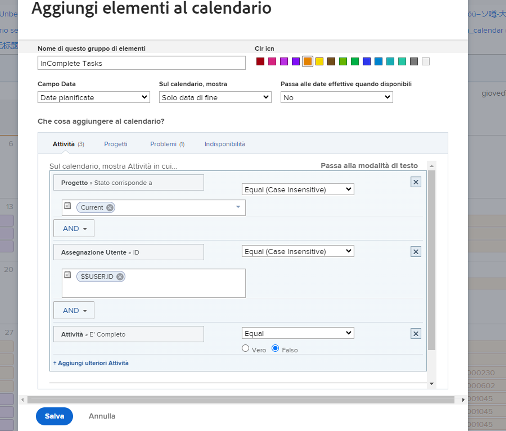
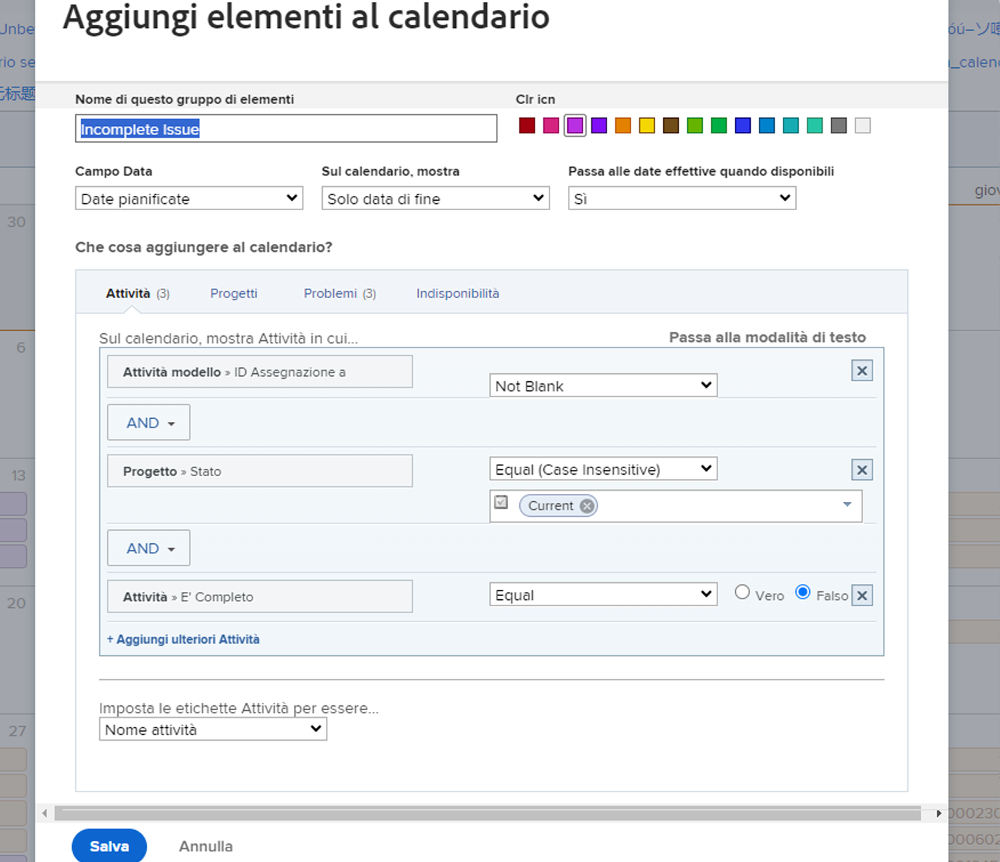
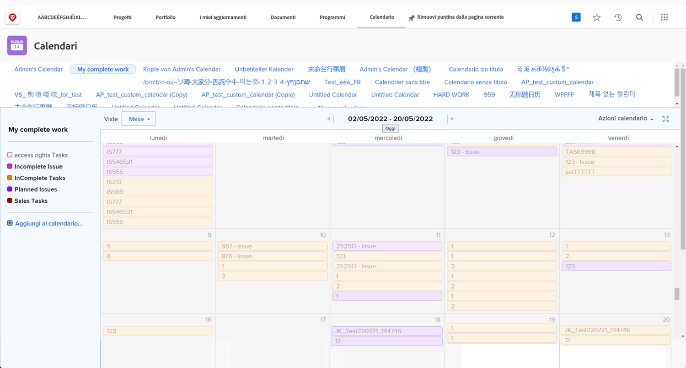

# Creare un proprio rapporto calendario

In questa attività ti occuperai della creazione del tuo calendario.

## Attività: creare un calendario

Crea un calendario cliente denominato “Il mio lavoro incompleto”.

Includi un gruppo di calendario denominato “Attività incomplete” che mostra tutte le attività incomplete assegnate a te nei Progetti correnti.

Seleziona il rosso come colore per questi elementi.

Includi un altro gruppo di calendario denominato “Problemi incompleti” che mostra tutti i problemi incompleti assegnati a te nei Progetti correnti. Seleziona blu come colore per questi elementi.

## Risposta

1. Passa all’area Calendari dal menu Principale.
1. Fai clic sul pulsante Nuovo calendario e assegna il nome al calendario “Il mio lavoro incompleto”.
1. Nel primo raggruppamento fai clic su Aggiungi elementi avanzati.
1. Nella finestra Aggiungi elementi al calendario che viene visualizzata, assegna il nome “Attività incomplete” al gruppo.
1. Seleziona il rosso come colore.
1. Modifica il campo Data in Date pianificate.
1. Imposta il campo Mostra solo data di fine nel calendario.
1. Imposta il campo Passa alle date effettive quando disponibile su No.

   

1. Che cosa aggiungere al calendario? sezione, seleziona Attività.
1. Aggiungi tre regole di filtro:

   * Progetto > Stato equivale a > Uguale a > Corrente
   * Utenti dell’assegnazione > ID > Uguale > $$USER.ID
   * Attività > È completa > Uguale > Falso

1. Fai clic su Salva.

   

1. Crea un secondo raggruppamento facendo clic su Aggiungi al calendario.
1. In questo raggruppamento, fai clic su Aggiungi elementi avanzati.
1. Nella finestra Aggiungi elementi al calendario che viene visualizzata, assegna al gruppo il nome “Problemi incompleti”.
1. Seleziona blu come colore.
1. Modifica il campo Data in Date pianificate.
1. Imposta il campo Mostra solo data di fine nel calendario.
1. Imposta il campo Passa alle date effettive quando disponibile su No.
1. Che cosa aggiungere al calendario? sezione, seleziona Problemi.
1. Aggiungi le tre regole di filtro seguenti:

   * Progetto > Stato equivale a > Uguale a > Corrente
   * Utenti dell’assegnazione > ID > Uguale > $$USER.ID
   * Problema > È completo > Uguale > Falso

1. Fai clic su Salva.

   

Poiché hai usato $$USER.ID nei filtri, puoi condividere questo calendario con altri utenti, che visualizzeranno le proprie attività e i propri problemi incompleti.
