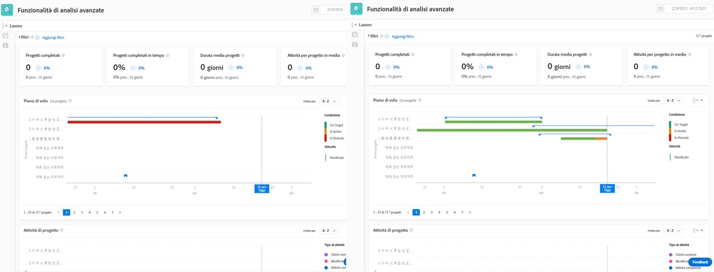

# Comprendere i KPI

In questo video scoprirai:

* Come ottenere valore dai dati KPI

>[!VIDEO](https://video.tv.adobe.com/v/335046/?quality=12&learn=on&enablevpops)

## Confrontare i KPI

I KPI non solo forniscono informazioni preziose su ciò che sta accadendo nel presente, ma offrono agli utenti la possibilità di confrontare i cambiamenti dell’attività nel tempo o la differenza tra portfolio, programmi, proprietari di progetti o qualsiasi altro filtro utilizzato.

Ad esempio, puoi richiamare l’analisi in due schede del browser per confrontare i KPI.
