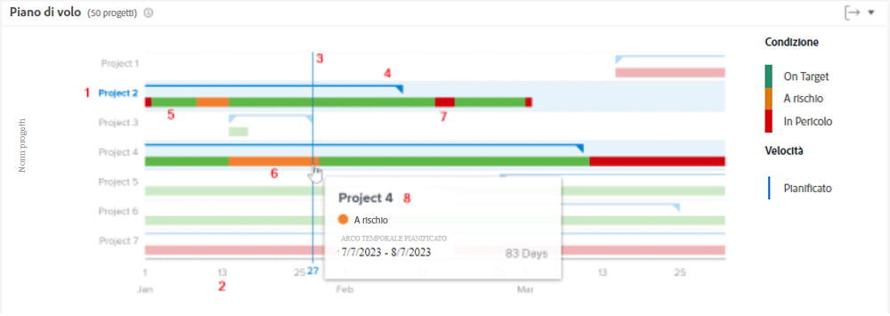
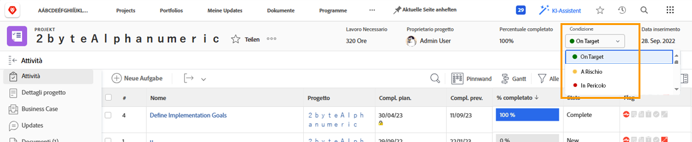
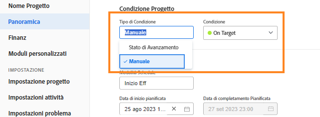

# Comprendere come navigare e rivedere i progetti in [!UICONTROL Analisi avanzata]

Questo video illustra:

* Come leggere la tabella del piano di volo

>[!VIDEO](https://video.tv.adobe.com/v/335047/?quality=12&learn=on)

## Grafico del piano di volo

Nel grafico puoi vedere:

1. I nomi dei progetti sono a sinistra.
1. Le date vengono visualizzate in basso.
1. La linea blu verticale mostra la data specifica in cui il mouse è posizionato con il cursore del mouse.
1. Le linee blu orizzontali mostrano le date di inizio e fine pianificate del progetto.
1. Le linee verdi indicano che il progetto è On Target.
1. Le linee arancioni indicano che il progetto è a rischio.
1. Le linee rosse indicano che il progetto è in difficoltà.

La visualizzazione di queste informazioni sui progetti consente di determinare:

* Quali eventi prolungano un progetto oltre la data di completamento pianificata.
* Quando si verifica un problema in un progetto.
* Quanti progetti sono aperti nello stesso periodo di tempo.
* Quanti progetti sono attivi.
* Quali progetti richiedono maggiore attenzione o supporto.

## La condizione è basata sullo stato di avanzamento

La condizione del progetto è una rappresentazione visiva dell’avanzamento del progetto. Workfront determina la condizione in base allo stato di avanzamento delle attività all’interno del progetto.

È possibile impostare la condizione di un progetto:

* **Manualmente**, da parte degli utenti con accesso per la gestione del progetto, quando il tipo di condizione del progetto è impostato su manuale. Questo consente di impostare la condizione del progetto indipendentemente dal percorso critico.
* **Automaticamente**, da Workfront, quando il tipo di condizione del progetto è impostato su Stato di avanzamento.

Workfront consiglia di impostare il tipo di condizione su Stato avanzamento in modo da avere un’indicazione chiara dell’avanzamento effettivo del progetto, in base all’avanzamento delle attività.

Quando è impostato su Stato di avanzamento, la condizione del progetto può essere:

* **On Target**- Quando lo stato di avanzamento dell&#39;ultima attività nel percorso critico è Puntuale, la condizione del progetto è Su destinazione. Il progetto sta per terminare secondo la pianificazione.
* **A Rischio**- Quando lo stato di avanzamento dell&#39;ultima attività nel percorso critico è Indietro o A rischio, la condizione del progetto è A rischio. Il progetto sta per finire in ritardo, ma non è ancora in ritardo.
* **In difficoltà**- Quando lo stato di avanzamento dell&#39;ultima attività nel percorso critico è In ritardo, la condizione del progetto è In difficoltà. La scadenza è nel passato e il progetto è ora in ritardo.

>[!NOTE]
>
>Le condizioni possono essere personalizzate per il tuo ambiente, quindi potresti trovare più di tre opzioni o i nomi potrebbero essere diversi da quelli di cui sopra. Per informazioni sulla personalizzazione delle condizioni, vedere l&#39;articolo [Creare o modificare una condizione personalizzata](https://experienceleague.adobe.com/docs/workfront/using/administration-and-setup/customize/custom-conditions/create-edit-custom-conditions.html?lang=en).
