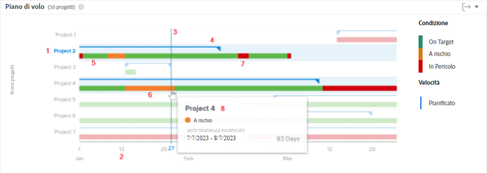
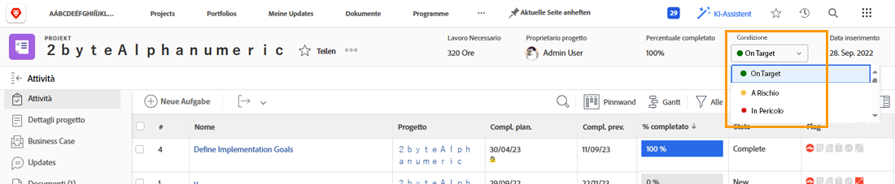
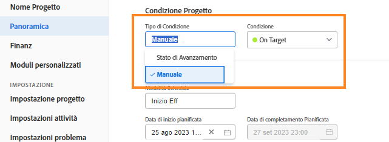

# Comprendere come navigare e rivedere i progetti

In questo video scoprirai:

* Come leggere il grafico Pianificazione in corso

>[!VIDEO](https://video.tv.adobe.com/v/335047/?quality=12&learn=on&enablevpops=1)

## Grafico Pianificazione in corso

Nel grafico puoi visualizzare:

1. I nomi dei progetti a sinistra.
1. Le date vengono visualizzate in basso.
1. La linea blu verticale mostra la data specifica su cui è posizionato il cursore del mouse.
1. Le linee blu orizzontali mostrano le date di inizio e di fine pianificate del progetto.
1. Le linee verdi indicano che il progetto è On Target.
1. Le linee arancioni indicano che il progetto è A rischio.
1. Le linee rosse indicano che il progetto è In difficoltà.

La visualizzazione di queste informazioni sui progetti consente di determinare:

* Quali eventi prolungano un progetto oltre la data di completamento pianificata.
* Quando si verifica un problema in un progetto.
* Quanti progetti sono aperti nello stesso periodo di tempo.
* Quanti progetti sono attivi.
* Quali progetti richiedono maggiore attenzione o supporto.

## La condizione è basata sullo stato di avanzamento

La condizione del progetto è una rappresentazione visiva del modo in cui sta avanzando il progetto. Workfront determina la condizione in base allo stato di avanzamento delle attività all’interno del progetto.

È possibile impostare la condizione di un progetto:

* **Manualmente**, dagli utenti con accesso per gestire il progetto, quando il tipo di condizione del progetto è impostato su manuale. Questo consente di impostare la condizione del progetto indipendentemente dal percorso critico.
* **Automaticamente**, da Workfront, quando il tipo di condizione del progetto è impostato su Stato di avanzamento.

Workfront consiglia di impostare il tipo di condizione su Stato di avanzamento in modo da avere un’indicazione chiara dell’avanzamento effettivo del progetto, in base all’avanzamento delle attività.

Quando è impostata su Stato di avanzamento, la condizione del progetto può essere:

* **On Target**: quando lo stato di avanzamento dell’ultima attività sul percorso critico è On Time, la condizione del progetto sarà On Target. Il progetto è sulla buona strada per terminare secondo la pianificazione.
* **A rischio**: quando lo stato di avanzamento dell’ultima attività sul percorso critico è In ritardo o A rischio, la condizione del progetto è A rischio. Il progetto sta per concludersi in ritardo, ma non è ancora in ritardo.
* **In difficoltà**: quando lo stato di avanzamento dell’ultima attività sul percorso critico è In ritardo, la condizione del progetto è In difficoltà. La scadenza è passata e il progetto adesso è in ritardo.

>[!NOTE]
>
>Le condizioni possono essere personalizzate per il tuo ambiente, pertanto potresti trovare più di tre opzioni oppure i nomi potrebbero essere diversi da quelli indicati in precedenza. Per informazioni sulla personalizzazione delle condizioni, consulta l’articolo [Creare o modificare una condizione personalizzata](https://experienceleague.adobe.com/docs/workfront/using/administration-and-setup/customize/custom-conditions/create-edit-custom-conditions.html?lang=it).
