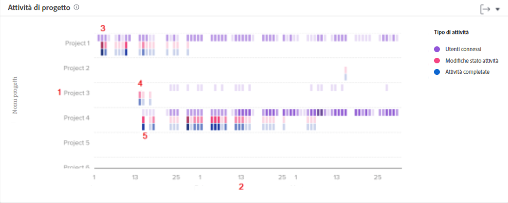

# Comprendere come navigare e rivedere le attività di progetto

In questo video scoprirai:

* Come confrontare i progetti in base agli utenti connessi, alle modifiche dello stato e alle attività completate

>[!VIDEO](https://video.tv.adobe.com/v/335049/?quality=12&learn=on)

## Confrontare il lavoro del progetto

Il grafico Attività progetto consente di comprendere e confrontare le attività di progetto, ovvero gli utenti connessi, le modifiche dello stato e le attività completate, rispetto ad altri progetti in Workfront. Le attività del progetto vengono visualizzate in colori diversi per riepilogare le attività in un periodo di tempo.

La visualizzazione di queste informazioni consente di determinare:

* L’attività su un progetto specifico.
* L’attività di un progetto rispetto ad altri progetti.
* Quali utenti stanno lavorando a un progetto e con quale frequenza.

Sul grafico puoi vedere:

1. Nomi di progetti a sinistra.
1. Le date vengono visualizzate in basso.
1. Le caselle viola mostrano che gli utenti assegnati al progetto hanno effettuato l’accesso in quel giorno, con un’ombreggiatura più scura che indica un numero maggiore di utenti.
1. Le caselle di colore rosa mostrano che gli utenti hanno modificato lo stato di un’attività per il progetto in quel giorno, con un’ombreggiatura più scura che indica la modifica di un numero maggiore di stati delle attività.
1. Le caselle blu indicano che gli utenti hanno completato un&#39;attività per il progetto, con un&#39;ombreggiatura più scura che indica il completamento di un maggior numero di attività.
