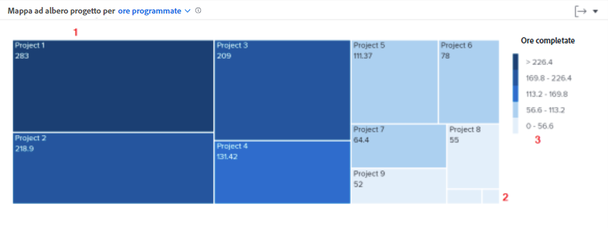

# Approfondimento della navigazione

In questo video scoprirai:

* Come vedere rapidamente quanto tempo le persone dedicano a ciascun progetto

>[!VIDEO](https://video.tv.adobe.com/v/335050/?quality=12&learn=on)

## Come rivedere il tempo dedicato ai progetti

La mappa ad albero del progetto consente di capire quanto tempo gli utenti hanno dedicato a un progetto. Le caselle rappresentano i progetti. La dimensione di ogni casella mostra quanto tempo è stato dedicato al progetto in questione rispetto ad altri progetti. Più grande è la casella, maggiore è il tempo trascorso.

La visualizzazione di queste informazioni consente di determinare:

* La priorità degli elementi su cui si sta lavorando durante l’intervallo di date selezionato.
* A quali attività viene dedicato il tempo degli utenti.
* Se gli utenti si concentrano sulle attività giuste.
* Quanto è cambiato l’ambito di un progetto in un periodo di tempo, quando viene selezionato un progetto specifico.

Sul grafico puoi vedere:

1. I progetti nel tempo filtrato con più ore completate, rappresentati da caselle più grandi e di colore blu scuro.
1. I progetti nel tempo filtrato che hanno meno ore completate, rappresentati da caselle più piccole e di un colore blu chiaro.
1. La legenda a destra del grafico, con l’intervallo di ore completate per ogni gradazione di blu.
