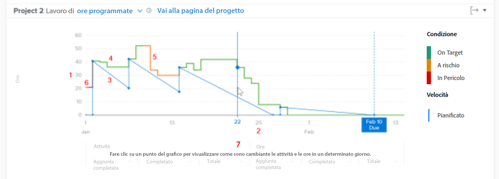

# Informazioni sull’accesso e la revisione del grafico di lavoro

In questo video scoprirai:

* Come accedere al grafico lavoro
* Come comprendere la relazione tra le ore rimanenti, la condizione del progetto e la velocità in un progetto

>[!VIDEO](https://video.tv.adobe.com/v/3438892/?captions=ita&quality=12&learn=on&enablevpops=1)

## Tracciare la velocità del progetto

Il grafico lavoro consente di comprendere la relazione tra le ore rimanenti, la condizione del progetto e la velocità. La linea continua mostra le ore trascorse sul progetto attraverso il tempo, nonché la condizione del progetto ogni giorno. La linea tratteggiata, che mostra la velocità pianificata dalla data di inizio alla data di completamento pianificata, viene modificata in base alle date delle attività.

La visualizzazione di queste informazioni consente di determinare:

* In che modo i problemi in arrivo (lavoro non pianificato) hanno influenzato il lavoro pianificato.
* Quali eventi hanno prolungato il progetto oltre la data di completamento pianificata.

Sul grafico puoi vedere:

1. Numero di ore a sinistra.
1. Le date vengono visualizzate in basso, inclusa la data di completamento pianificata del progetto, se presente nell’intervallo di date selezionato.
1. La linea blu continua mostra la velocità del progetto (ore pianificate o durata nel tempo), trasformandosi in una linea verticale tratteggiata quando raggiunge la data di completamento pianificata per il progetto.
1. Le linee verdi indicano quando la condizione del progetto è in linea con le previsioni.
1. Le linee arancioni indicano quando la condizione del progetto è A rischio.
1. Le linee rosse indicano quando la condizione del progetto è In difficoltà.
1. Le informazioni sulle attività e sulle ore (totali, importo aggiunto e importo completato) in un giorno specifico vengono visualizzate sotto l’asse x quando fai clic su un punto specifico del grafico.
