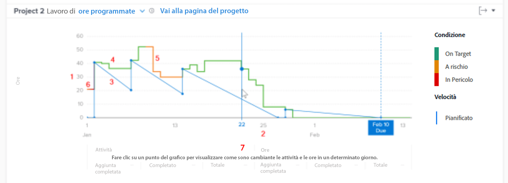

# Comprendere l’accesso e la revisione del menu a discesa in [!UICONTROL Analisi avanzata]

In questo video imparerai:

* Come accedere al grafico a discesa
* Come comprendere la relazione tra le ore rimanenti, la condizione del progetto e la velocità di un progetto

>[!VIDEO](https://video.tv.adobe.com/v/335051/?quality=12)

## Tracciare la velocità del progetto

Il grafico a discesa consente di comprendere la relazione tra le ore rimanenti, la condizione del progetto e la velocità. La linea continua mostra le ore dedicate al progetto nel tempo, nonché le condizioni del progetto ogni giorno. La linea tratteggiata, che mostra la velocità pianificata dalla data di inizio alla data di completamento pianificato, viene regolata in base alla modifica delle date delle attività.

La visualizzazione di queste informazioni consente di determinare:

* Come i problemi in arrivo (lavoro non pianificato) hanno influenzato il lavoro pianificato.
* Quali eventi hanno esteso il progetto oltre la data di completamento pianificata.

Nel grafico puoi vedere:

1. Numero di ore a sinistra.
1. Le date vengono visualizzate in basso, inclusa la data di completamento pianificato del progetto, se vengono visualizzate nell’intervallo di date selezionato.
1. La linea blu continua mostra la velocità del progetto (ore pianificate o durata nel tempo), trasformandosi in una linea verticale tratteggiata quando raggiunge la data di completamento pianificata per il progetto.
1. Le linee verdi indicano quando la condizione del progetto è Su Target.
1. Le linee arancioni indicano quando la condizione del progetto è a rischio.
1. Le linee rosse indicano quando la condizione del progetto è In Trouble.
1. Quando si fa clic su un punto specifico del grafico, le informazioni relative alle attività e alle ore (totali, quantità aggiunta e quantità completata) in un giorno specifico vengono visualizzate sotto l&#39;asse x.
