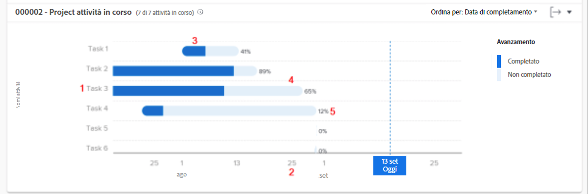

# Rivedere le attività in corso

In questo video scoprirai:

* Come accedere al grafico Attività in corso
* Come vedere rapidamente quali attività non sono state completate in un progetto

>[!VIDEO](https://video.tv.adobe.com/v/335052/?quality=12&learn=on)

## Dati a livello di attività

Il grafico delle attività in corso consente di analizzare in dettaglio le attività di un progetto specifico per verificare la quantità di lavoro completata per ogni attività attiva e quanto le attività sono in linea con i tempi previsti. Il grafico ti consente di capire quali attività di un progetto devono essere completate e qual è la percentuale di completamento per tali attività.

Queste informazioni possono essere utili per determinare:

* Su cosa stanno lavorando le persone.
* Quali attività potrebbero mettere a rischio un progetto.
* Quanto è vicina al completamento un’attività.
* A chi riviolgersi per un’attività specifica.

Sul grafico puoi vedere:

1. Nomi delle attività a sinistra.
1. Date sul fondo.
1. Il colore blu scuro all’interno di una barra delle attività indica la quantità di lavoro completata per un’attività.
1. Il colore azzurro all’interno di una barra delle attività indica la quantità di lavoro che deve essere completata per un’attività.
1. Il numero sul lato destro della barra delle attività mostra la percentuale di completamento dell’attività.
