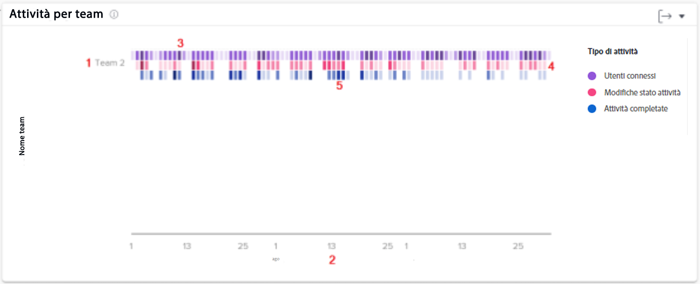

# Comprendere l’attività in base al grafico del team in [!UICONTROL Analisi avanzata]

Il grafico Attività per team consente di comprendere in che modo i team di origine della tua organizzazione trascorrono il loro tempo in Workfront. Gli utenti di Workfront possono trovarsi su più team, ma possono far parte di un solo team domestico. I team utilizzati nei grafici Persone sono costituiti solo dagli utenti che hanno designato tale team come team principale.

Le attività (utenti connessi, modifiche dello stato delle attività e attività completate) vengono visualizzate in colori diversi per riepilogare gli eventi nel periodo di tempo filtrato.

La visualizzazione di queste informazioni consente di determinare:

* Quali attività si verificano all&#39;interno di un team domestico e a quale ritmo.
* Quali home team vengono sovraccaricati di lavoro o utilizzano di più il sistema.
* Se la distribuzione del lavoro è appropriata per la squadra di casa.

Nel grafico puoi vedere:

1. Nomi della squadra a sinistra.
1. Le date in basso provengono dall’intervallo di date selezionato.
1. Le caselle viola mostrano che gli utenti assegnati al progetto hanno effettuato l’accesso quel giorno, con un’ombreggiatura più scura che indica un numero maggiore di utenti che effettuano l’accesso.
1. Le caselle rosa mostrano che gli utenti hanno modificato lo stato di un&#39;attività del progetto in quel giorno, con un&#39;ombreggiatura più scura che indica un numero maggiore di stati dell&#39;attività che cambiano.
1. Le caselle blu mostrano che gli utenti hanno completato un’attività per il progetto, con un’ombreggiatura più scura che indica un numero maggiore di attività completate.

## Come spostarsi al grafico

1. Fai clic sul pulsante [!UICONTROL Persone] nel pannello a sinistra.
1. Utilizza la [!UICONTROL Filtro] per scegliere uno o più team Home da esaminare.
1. Il grafico dell&#39;attività per gruppo verrà visualizzato nella parte superiore dei grafici delle persone.
