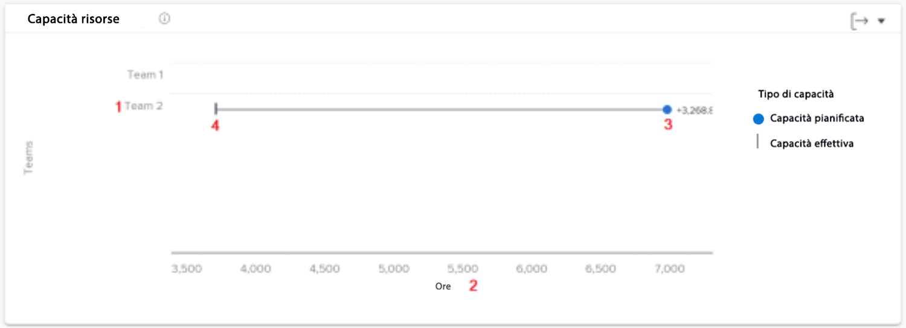
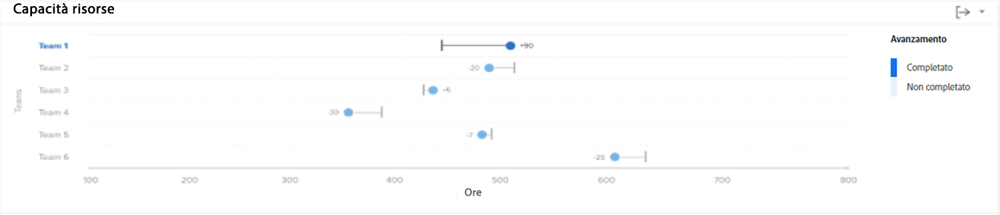

# Comprendere il grafico della capacità delle risorse in [!UICONTROL Analisi avanzata]

Il grafico sulla capacità delle risorse mostra il numero di ore pianificate assegnate a un team principale entro il periodo di tempo filtrato rispetto alle ore totali disponibili del team.

Questo confronto può essere utile per determinare se non si assegna abbastanza lavoro al team o se si sta verificando un esaurimento da un carico di lavoro pesante. Fare clic sul nome di un team e viene visualizzato un grafico della capacità del team, che mostra ulteriori dettagli sulla capacità del team per il periodo di tempo filtrato.

La visualizzazione di queste informazioni consente di determinare:

* Se una squadra principale è stata sovrassegnata o è stata allocata.
* Quali home team sono disponibili per il lavoro.

Nel grafico sono disponibili i seguenti dettagli chiave:

1. I nomi della home team sono a sinistra.
1. Le ore sono in fondo. Questo è l&#39;asse x del grafico e calcola in base all&#39;intervallo di ore visualizzate nei team qui sopra.
1. Il cerchio mostra il numero di ore pianificate assegnate al team principale.
1. La linea verticale mostra il numero totale di ore disponibili per il team principale.

## Come spostarsi al grafico

1. Fai clic sul pulsante [!UICONTROL Persone] nel pannello a sinistra.
1. Utilizza la [!UICONTROL Filtro] per scegliere un team Home da esaminare.
1. Verrà visualizzata la [!UICONTROL Capacità delle risorse] sotto il grafico delle attività del team.

## Come utilizzare il grafico

È necessario aggiungere filtri e selezionare un intervallo di date per visualizzare i dati nei grafici [!UICONTROL Analisi migliorata] area di Workfront. Se in precedenza sono stati aggiunti dei filtri, questi saranno attivi fino alla loro rimozione.

Nel grafico della capacità delle risorse è possibile:

* Passa il puntatore del mouse sulla linea del team principale per vedere quante ore sono ancora disponibili per la pianificazione, la quantità di ore pianificate per il completamento del team principale e il numero totale di ore lavorate (etichettate come in eccesso, in esaurimento o alla capacità).
* Esporta i dati del grafico utilizzando il pulsante di esportazione nell’angolo in alto a destra del grafico.
* Fare clic sul nome del team principale per aprire il grafico della capacità del team. Quando si esegue lo zoom in un arco temporale più piccolo nel grafico della capacità del team, i dati visualizzati nel grafico della capacità delle risorse vengono aggiornati.
