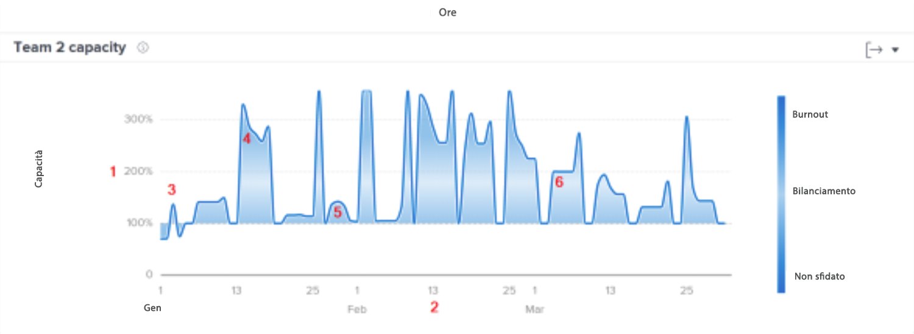
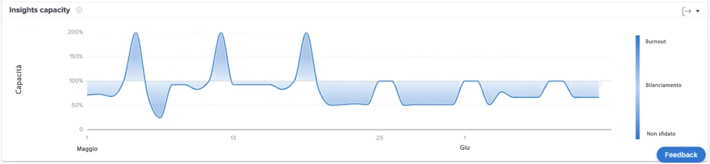

# Comprendere la capacità del team

Il grafico della capacità del team mostra quando un team predefinito è stato sovra-assegnato o sotto-assegnato. Il grafico mostra il volume di lavoro assegnato al team predefinito in un determinato giorno e attribuisce un colore blu più scuro quando il team si avvicina al burnout o non ha abbastanza lavoro. Un colore più chiaro e trasparente indica invece che il carico di lavoro è più bilanciato.

La visualizzazione di queste informazioni consente di determinare:

* se il team predefinito è stato sovra-assegnato o sotto-assegnato;
* se il team predefinito è sovra-assegnato o sotto-assegnato su base giornaliera;
* se il carico di lavoro di un team predefinito è equilibrato da un giorno all’altro;
* se si creano problemi di capacità con nuovi lavori.

Sul grafico puoi vedere:

1. La percentuale di capacità del team predefinito è riportata a sinistra.
1. Le date nella parte inferiore provengono dall’intervallo di date selezionato.
1. Il colore di riempimento blu più scuro indica che il team predefinito sta attraversando un burnout (4) o non ha abbastanza lavoro.
1. Il blu più chiaro o più trasparente indica che il carico di lavoro del team predefinito è bilanciato

## Come arrivare al grafico

1. Fai clic sulla scheda [!UICONTROL Persone] nel pannello sinistro.
1. Utilizza il [!UICONTROL Filtro] per scegliere uno o più team predefiniti da esaminare.
1. Verrà visualizzato il grafico della capacità del team.

## Come utilizzare il grafico

Per visualizzare i dati nei grafici nella sezione Persone dell’area Analisi, devi aggiungere dei filtri e selezionare un intervallo di date. I filtri aggiunti in precedenza rimangono attivi fino a quando non vengono rimossi.

Nel grafico Capacità del team puoi effettuare le seguenti operazioni:

* Passare il cursore del mouse su un punto del grafico per vedere la linea della data.
* Passa il cursore del mouse su un punto della riga del grafico per visualizzare le ore pianificate e le ore pianificate per la data specificata, nonché la percentuale di capacità e se in tale momento il team predefinito lavorava a piena capacità oppure se questa era stata superata o non raggiunta.
* Per ingrandire le date, fai clic e trascina su un determinato punto del progetto. Questa azione aggiorna tutti gli altri grafici, che vengono ingranditi sullo stesso intervallo di date.
* Esporta i dati del grafico con il pulsante Esporta, nell’angolo in alto a destra del grafico.
