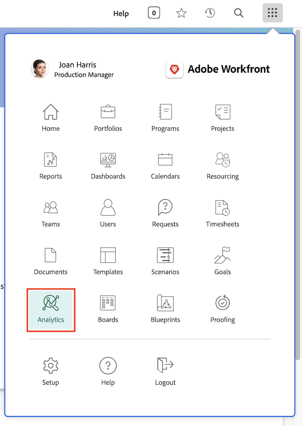

# Come accedere ad Analisi avanzate

Come la maggior parte delle altre funzionalità di Workfront, puoi accedere a [!UICONTROL Analisi avanzate] dal menu principale. Tuttavia, [!UICONTROL Analisi] non è nel menu principale per impostazione predefinita.

Se non viene visualizzata, l’amministratore di sistema o di gruppo dovrà aggiungerla per conto tuo. Verrà fatto in un modello layout. Il video seguente spiega come fare.

## Aggiungere Analytics ai modelli layout

Questo video illustra come gli amministratori di sistema e di gruppo concedono l’accesso ad [!UICONTROL Analytics] in Workfront.

>[!VIDEO](https://video.tv.adobe.com/v/335045/?quality=12&learn=on)

Chiunque disponga di una licenza Workfront (in piani [!UICONTROL Workfront Business] o superiori) può accedere ad [!UICONTROL Analytics] dopo averlo aggiunto al modello layout assegnatogli. Tuttavia, visualizzerai i progetti e le informazioni utente solo se consentito dal tuo livello di accesso in Workfront e dalle autorizzazioni di condivisione per progetti e utenti specifici.
