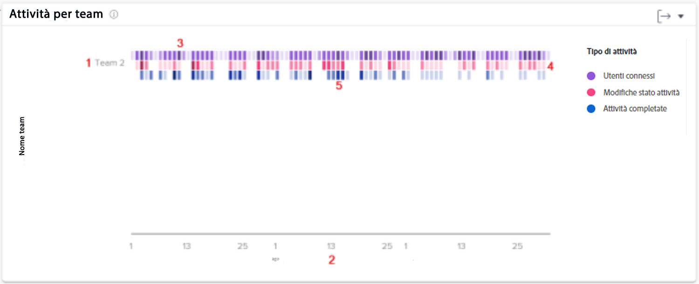

# Comprendere i grafici lavoro e persone

I grafici di lavoro mostrano l&#39;attività dal punto di vista del progetto e dell&#39;attività, mentre il grafico Persone mostra l&#39;attività dal punto di vista di un team principale.

Seleziona il tipo di grafici di analisi da visualizzare (Lavoro o Persone) dal menu del pannello a sinistra.

## Grafici Lavoro

![Immagine della ricerca della funzione [!UICONTROL Analisi] in [!DNL Workfront Classic]](assets/section-1-1.png)

Quando passi ai grafici di lavoro, per impostazione predefinita visualizzerai:

1. Statistiche KPI
1. Piano di volo
1. Attività di progetto
1. Mappa ad albero del progetto (non mostrata sopra)

I grafici di lavoro e Attività in corso vengono visualizzati quando si esegue un drill-down dei dati.

* Facendo clic su un progetto nella vista Pianificazione in corso sotto verrà visualizzata una vista Grafico di lavoro.
* Facendo clic su un progetto nella visualizzazione Mappa ad albero sotto verranno mostrate le viste Grafico di lavoro e Attività in corso.

## Grafico Persone - Attività per team

Sul grafico puoi vedere:

1. I nomi dei team predefiniti a sinistra.
1. Le date nella parte inferiore provengono dall’intervallo di date selezionato.
1. Le caselle viola mostrano che gli utenti assegnati al progetto hanno effettuato l’accesso in quel giorno, con un’ombreggiatura più scura che indica un numero maggiore di utenti.
1. Le caselle di colore rosa mostrano che gli utenti hanno modificato lo stato di un’attività per il progetto in quel giorno, con un’ombreggiatura più scura che indica la modifica di un numero maggiore di stati delle attività.
1. Le caselle blu indicano che gli utenti hanno completato un&#39;attività per il progetto, con un&#39;ombreggiatura più scura che indica il completamento di un maggior numero di attività.

