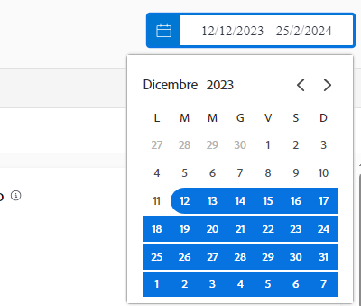

# Comprendere gli intervalli di date e gli archi temporali

Durante la visualizzazione dei grafici di [!DNL Enhanced analytics], gli intervalli di date vengono specificati utilizzando il widget del calendario. Gli archi temporali vengono creati all’interno di un grafico quando fai clic e trascini con il mouse per definire un’area specifica, in modo da poter ingrandire e ottenere informazioni più dettagliate durante tale arco di tempo.

## Intervalli di date

Fai clic su una data qualsiasi nel calendario per indicare una data nell’intervallo, quindi fai clic su una data per indicare il termine dell’intervallo. Utilizza le frecce nella parte superiore del calendario per passare a un mese diverso se le date di inizio e di fine non sono nello stesso mese.

Per impostazione predefinita, i grafici in [!DNL Analytics] mostrano i dati degli ultimi 60 giorni e dei successivi 15 giorni. Puoi selezionare un nuovo intervallo di date e applicarlo a tutti i grafici quando utilizzi [!DNL Analytics].

Quando aggiorni la pagina, ti sposti o esci da Workfront, l’intervallo di date viene reimpostato sul valore predefinito.

## Archi temporali

Fai clic e trascina una sezione desiderata di una timeline per creare un filtro per l’arco temporale. Questo intervallo di tempo ora si applica a tutti i grafici nell’area di lavoro e viene visualizzato accanto a qualsiasi altro filtro nella barra dei filtri. Approfondisci un grafico facendo clic e trascinando le aree per aggiornare l’arco temporale. Per rimuovere il filtro dell’arco temporale, posiziona il cursore del mouse su di esso nella barra del filtro e fai clic sulla X che viene visualizzata.

Quando aggiorni la pagina, ti sposti o esci da Workfront, l’intervallo di tempo viene rimosso e l’intervallo di date viene reimpostato.

>[!NOTE]
>
>Non è possibile utilizzare l’opzione dell’arco temporale con i grafici Mappa ad albero del progetto.
