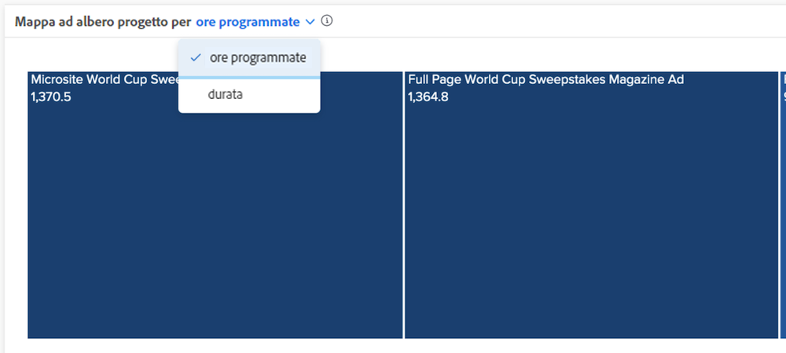

# Informazioni sulle visualizzazioni delle ore pianificate e della durata

Nei grafici di lavoro e mappa ad albero del progetto è possibile visualizzare le informazioni in base alle ore pianificate o alla durata, a seconda di ciò che ritieni più appropriato per il tuo ambiente Workfront.

Il valore predefinito è Ore pianificate. Se passi alla durata, questa selezione rimane attiva se esci da [!DNL Analytics] e poi torni indietro o passi da un accesso a Workfront all’altro.

## Che cosa significano le dimensioni della casella e la tonalità dei colori?

Le caselle blu più piccole e più chiare indicano un numero inferiore di ore, mentre le caselle più grandi e in tonalità più scure indicano un numero maggiore di ore. Per ulteriori informazioni, consulta [Informazioni sulla visualizzazione mappa ad albero del progetto](https://experienceleague.adobe.com/docs/workfront/using/reporting/enhanced-analytics/project-treemap-overview.html?lang=it).
