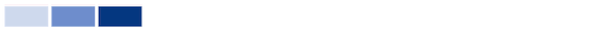

# Comprendere le azioni in [!UICONTROL Analisi avanzata] - passa il puntatore del mouse, fai clic e trascina, quindi fai clic su

In questo video imparerai:

* Come ottenere ulteriori informazioni passando il mouse su un grafico
* Creare un arco temporale su un grafico
* Come visualizzare grafici aggiuntivi

>[!VIDEO](https://video.tv.adobe.com/v/335044/?quality=12&learn=on)

## Fare clic su un grafico per ulteriori informazioni

Facendo clic su alcune parti di un grafico vengono visualizzati grafici aggiuntivi o un raggruppamento delle informazioni del grafico.

* **piano di volo**- Fai clic sul nome del progetto per visualizzare il menu a discesa e le attività nei grafici di volo.
* **Attività del progetto**- Fai clic sul nome del progetto per espandere il grafico e visualizzare l’attività del progetto in base all’utente.
* **Treemap del progetto**- Fare clic su una casella del progetto per richiamare le attività di Burndown e Tasks nei grafici a volo.
* **Attività per team**- Fai clic sul nome del team per espandere il grafico e visualizzare l&#39;attività in base all&#39;utente.
* **Capacità delle risorse**- Fare clic sul nome del team per visualizzare il grafico della capacità del team.

## Cosa significa un&#39;ombra più scura e più leggera quando si tratta di attività di squadra?

**Utenti connessi:** Le caselle viola mostrano che le persone del team di casa hanno effettuato l&#39;accesso quel giorno. Una tonalità più scura indica un numero maggiore di persone che accedono.

**Modifica stato attività:** Le caselle rosa mostrano che le persone del team di casa hanno cambiato lo stato di un&#39;attività in quel giorno. Un&#39;ombreggiatura più scura indica un numero maggiore di stati di attività che cambiano.

**Attività completate:** Le scatole blu mostrano che le persone del team di casa hanno completato un&#39;attività in quel giorno. Una tonalità più scura indica un numero maggiore di attività completate.

Per ulteriori informazioni consulta [Visualizzazione dell’attività per team](https://experienceleague.adobe.com/docs/workfront/using/reporting/enhanced-analytics/activity-by-team-overview.html?lang=en).
