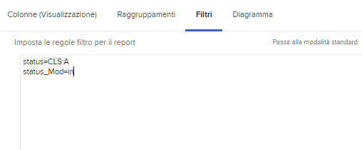

# Comprendere la modalità testo di base per i filtri

In questo video imparerai:

* Modalità testo
* Che caso di cammello è
* Modalità testo &quot;plug and play&quot; di base utilizzabile nei filtri dei rapporti

>[!VIDEO](https://video.tv.adobe.com/v/336820/?quality=12)

La seguente modalità di testo esclude le attività in cui l’utente ha contrassegnato la dicitura &quot;Fine con la parte personale&quot;. Tutto quello che devi fare è creare un filtro attività, aggiungere le regole di filtro desiderate, quindi passare alla modalità testo e incollare il codice sottostante dopo qualsiasi modalità di testo che vedi nel filtro.

```
EXISTS:1:$$OBJCODE=ASSGN  
EXISTS:1:taskID=FIELD:ID  
EXISTS:1:status=DN  
EXISTS:1:status_Mod=notin  
EXISTS:1:assignedToID=$$USER.ID 
```

## Attività: Domande sulla modalità testo

1. Come si scrive il cammello per il campo &quot;Inserito per ID&quot;?
1. In un rapporto del problema, crea un filtro per mostrare i problemi che sono stati contrassegnati come chiusi ma che sono in attesa di approvazione.

## Risposte

1. Il cammello del campo &quot;Inserito da ID&quot; deve essere scritto in questo modo—enterByID
1. La modalità di testo dovrebbe essere simile alla seguente nel filtro per report dei problemi:

   
