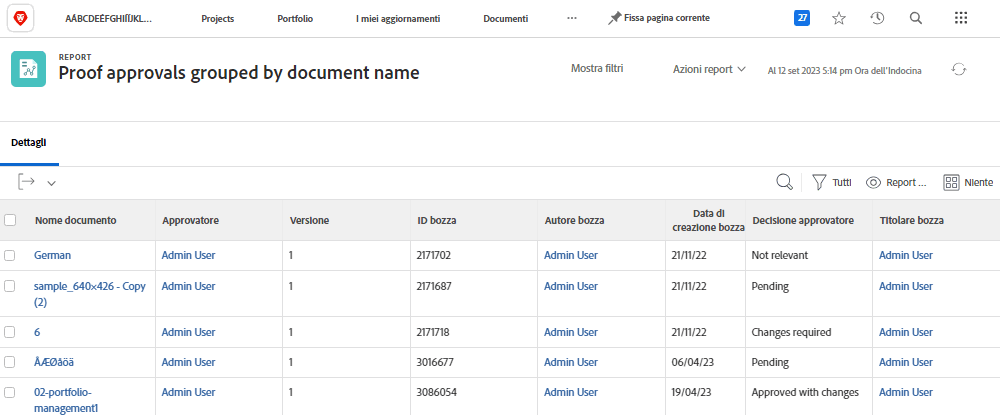

# Comprendere la modalità testo di base per i raggruppamenti

>[!PREREQUISITES]
>
>* [Informazioni sugli elementi di reporting](https://experienceleague.adobe.com/docs/workfront-learn/tutorials-workfront/reporting/basic-reporting/reporting-elements.html?lang=it)
>* [Informazioni sui componenti di reporting](https://experienceleague.adobe.com/docs/workfront-learn/tutorials-workfront/reporting/basic-reporting/reporting-components.html?lang=it)
>* [Creare un raggruppamento di base](https://experienceleague.adobe.com/docs/workfront-learn/tutorials-workfront/reporting/basic-reporting/create-a-basic-grouping.html?lang=it)


>[!TIP]
>
>* Per comprendere meglio la modalità testo, ti consigliamo di guardare l’evento webinar registrato [Le domande agli esperti - Introduzione alla reportistica in modalità testo](https://experienceleague.adobe.com/en/docs/events/classics/reporting-and-dashboards/introduction-to-text-mode-reporting), della durata di un’ora.
>* Per ulteriori informazioni sulla modalità testo, ti consigliamo di guardare i tutorial sulla [Reportistica avanzata](https://experienceleague.adobe.com/docs/workfront-learn/tutorials-workfront/reporting/advanced-reporting/welcome-to-advanced-reporting.html?lang=it) che hanno una durata totale di cinque ore e mezzo.
>* Fai clic qui per accedere a [[!UICONTROL API Explorer]](https://developer.adobe.com/workfront/api-explorer/)

In questo video scoprirai:

* Che cos’è la modalità testo
* Che cos’è la notazione a cammello
* Alcuni _blocchi di codice in modalità testo_ che puoi utilizzare nei raggruppamenti di rapporti

>[!VIDEO] (https://video.tv.adobe.com/v/3470787/?quality=12&learn=on&enablevpops=0&captions=ita

## Attività &quot;Comprendere la modalità testo di base per i raggruppamenti&quot;

### Attività: raggruppamento di 4 elementi principali

La seguente modalità di testo raggrupperà le attività in base a un massimo di quattro livelli di elementi principali e lascerà vuoti gli elementi principali che non esistono.

```
textmode=true
group.0.name=Parents
group.0.valueexpression=CONCAT({parent}.{parent}.{parent}.{parent}.{name},IF(ISBLANK({parent}.{parent}.{parent}.{parent}.{name}),"",", "),{parent}.{parent}.{parent}.{name},IF(ISBLANK({parent}.{parent}.{parent}.{name}),"",", "),{parent}.{parent}.{name},IF(ISBLANK({parent}.{parent}.{name}),"",", "),IF(ISBLANK({parent}.{name}),"No parent",{parent}.{name}))
group.0.linkedname=parent
group.0.namekeyargkey.0=parent
group.0.namekeyargkey.1=name
group.0.valueformat=string
```


### Attività: raggruppamento per percentuale di completamento

La seguente modalità di testo raggrupperà le attività in base alla percentuale di completamento. Quando saranno raggruppate, le attività rientreranno in una delle seguenti categorie:

* 0%
* Dall’1% al 25%
* Dal 26% al 50%
* Dal 51% al 75%
* Dal 76% al 99%
* 100%

```
group.0.linkedname=direct
group.0.namekey=percentComplete
group.0.valueexpression=IF({percentComplete}<1,"0%",IF({percentComplete}<26,"1% to 25%",IF({percentComplete}<51,"26% to 50%",IF({percentComplete}<76,"51% to 75%",IF({percentComplete}<100,"76% to 99%",IF({percentComplete}=100,"100","***"))))))
group.0.valueformat=doubleAsString
textmode=true
```


### Attività: statusEquatesWith, quindi per stato

La seguente modalità di testo raggrupperà le attività per statusEquatesWith, quindi per stato.

```
group.0.enumclass=com.attask.common.constants.TaskStatusEnum
group.0.enumtype=TASK
group.0.linkedname=direct
group.0.name=State
group.0.type=enum
group.0.valuefield=statusEquatesWith
group.0.valueformat=val
group.1.enumclass=com.attask.common.constants.TaskStatusEnum
group.1.enumtype=TASK
group.1.linkedname=direct
group.1.namekey=status
group.1.type=enum
group.1.valuefield=status
group.1.valueformat=val
textmode=true
```


### Approvazione bozze: raggruppa per nome del progetto

```
group.0.valueformat=HTML
group.0.valuefield=documentVersion:document:project:name
group.0.displayname=Project Name
```


### Approvazione bozze: raggruppa per nome del documento

```
group.0.displayname=Document Name
group.0.valuefield=documentVersion:document:name
group.0.valueformat=HTML
```



