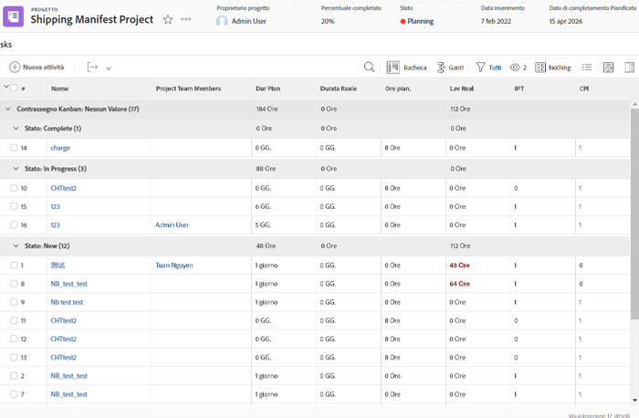
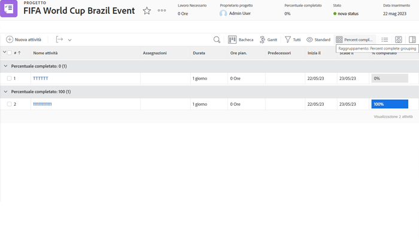
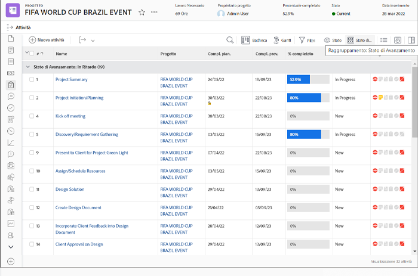
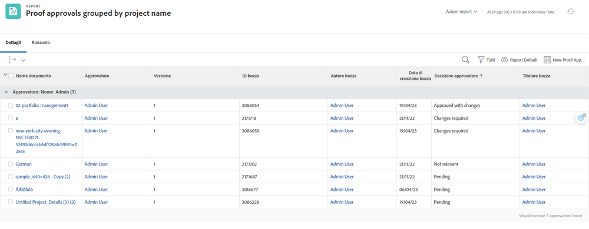

# Comprendere la modalità testo di base per i raggruppamenti

>[!IMPORTANT]
>
>Prerequisiti:
>
>* Comprendere gli elementi di reporting
>* Comprendere i componenti di reporting
>* Creare un raggruppamento di base


In questo video imparerai:

* Modalità testo
* Che caso di cammello è
* Modalità testo &quot;plug and play&quot; di base che è possibile utilizzare nei raggruppamenti

>[!VIDEO](https://video.tv.adobe.com/v/3410641/?quality=12)

## Attività - Raggruppamento di 4 genitori

La seguente modalità di testo consente di raggruppare le attività in base a un massimo di quattro livelli di elementi principali e di lasciare gli elementi principali che non esistono vuoti.

```
textmode=true
group.0.name=Parents
group.0.valueexpression=CONCAT({parent}.{parent}.{parent}.{parent}.{name},IF(ISBLANK({parent}.{parent}.{parent}.{parent}.{name}),"",", "),{parent}.{parent}.{parent}.{name},IF(ISBLANK({parent}.{parent}.{parent}.{name}),"",", "),{parent}.{parent}.{name},IF(ISBLANK({parent}.{parent}.{name}),"",", "),IF(ISBLANK({parent}.{name}),"No parent",{parent}.{name}))
group.0.linkedname=parent
group.0.namekeyargkey.0=parent
group.0.namekeyargkey.1=name
group.0.valueformat=string
```




## Attività - Percentuale di raggruppamento completo

La seguente modalità di testo raggrupperà le attività in base alla loro percentuale di completamento. Le attività rientrano in una delle seguenti categorie quando sono raggruppate:

* 0%
* Da 1% a 25%
* Da 26% a 50%
* Da 51% a 75%
* Da 76% a 99%
* 100%

```
group.0.linkedname=direct
group.0.namekey=percentComplete
group.0.valueexpression=IF({percentComplete}<1,"0%",IF({percentComplete}<26,"1% to 25%",IF({percentComplete}<51,"26% to 50%",IF({percentComplete}<76,"51% to 75%",IF({percentComplete}<100,"76% to 99%",IF({percentComplete}=100,"100","***"))))))
group.0.valueformat=doubleAsString
textmode=true
```



## Task - statusEquatesWith, quindi stato

La seguente modalità di testo raggruppa le attività per statusEquatesWith, quindi per stato.

```
group.0.enumclass=com.attask.common.constants.TaskStatusEnum
group.0.enumtype=TASK
group.0.linkedname=direct
group.0.name=State
group.0.type=enum
group.0.valuefield=statusEquatesWith
group.0.valueformat=val
group.1.enumclass=com.attask.common.constants.TaskStatusEnum
group.1.enumtype=TASK
group.1.linkedname=direct
group.1.namekey=status
group.1.type=enum
group.1.valuefield=status
group.1.valueformat=val
textmode=true
```




## Approvazione bozza - Raggruppa per nome del progetto

```
group.0.valueformat=HTML
group.0.valuefield=documentVersion:document:project:name
group.0.displayname=Project Name
```



