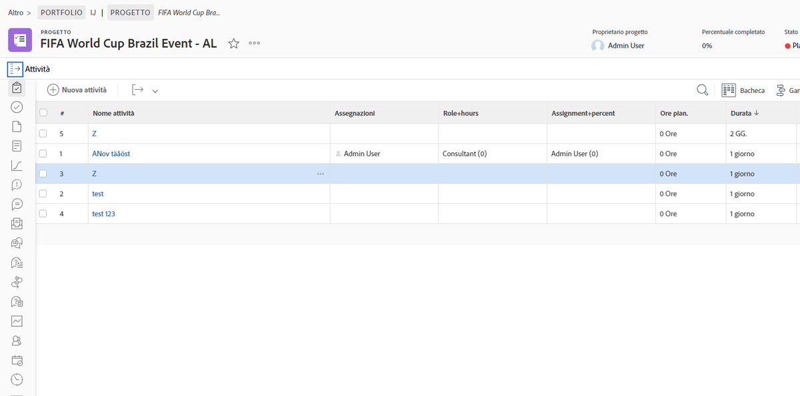
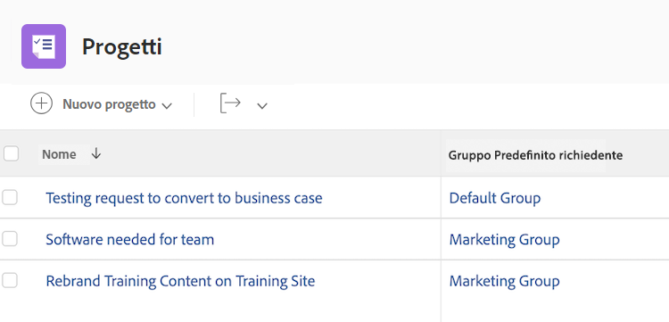
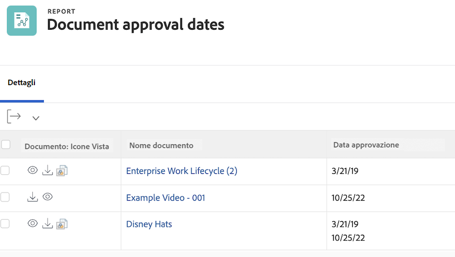

# Comprendere la modalità testo di base per le visualizzazioni


>[!PREREQUISITES]
>
>* [Informazioni sugli elementi di reporting](https://experienceleague.adobe.com/docs/workfront-learn/tutorials-workfront/reporting/basic-reporting/reporting-elements.html?lang=it)
>* [Informazioni sui componenti di reporting](https://experienceleague.adobe.com/docs/workfront-learn/tutorials-workfront/reporting/basic-reporting/reporting-components.html?lang=it)
>* [Creare una vista di base](https://experienceleague.adobe.com/docs/workfront-learn/tutorials-workfront/reporting/basic-reporting/create-a-basic-view.html?lang=it)


>[!TIP]
>
>* Per comprendere meglio la modalità testo, ti consigliamo di guardare l’evento webinar registrato [Le domande agli esperti - Introduzione alla reportistica in modalità testo](https://experienceleague.adobe.com/it/docs/events/classics/reporting-and-dashboards/introduction-to-text-mode-reporting), della durata di un’ora.
>* Per ulteriori informazioni sulla modalità testo, ti consigliamo di guardare i tutorial sulla [Reportistica avanzata](https://experienceleague.adobe.com/docs/workfront-learn/tutorials-workfront/reporting/advanced-reporting/welcome-to-advanced-reporting.html?lang=it) che hanno una durata totale di cinque ore e mezzo.
>* Fai clic qui per accedere a [[!UICONTROL API Explorer]](https://developer.adobe.com/workfront/api-explorer/)

In questo video scoprirai:

* Che cos’è la modalità testo
* Che cos’è la notazione a cammello
* Alcuni _blocchi di codice in modalità testo_ che puoi utilizzare nelle visualizzazioni dei report

>[!VIDEO](https://video.tv.adobe.com/v/3470796/?quality=12&learn=on&captions=ita)

## Attività &quot;Comprendere la modalità testo di base per le visualizzazioni&quot;

### Attività: vista a 4 elementi principali

Crea innanzitutto una colonna per il Nome attività e il Nome principale, quindi utilizza la modalità testo seguente per creare le altre tre colonne.

#### Attività: principale del nome principale

```
displayname=Parent of Parent Name
linkedname=parent
namekey=view.relatedcolumn
namekeyargkey.0=parent
namekeyargkey.1=name
querysort=parent:parent:name
textmode=true
valuefield=parent:parent:name
valueformat=HTML
```

#### Attività: principale del principale del nome principale

```
displayname=Parent of Parent of Parent Name
linkedname=parent
namekey=view.relatedcolumn
namekeyargkey.0=parent
namekeyargkey.1=name
querysort=parent:parent:parent:name
textmode=true
valuefield=parent:parent:parent:name
valueformat=HTML
```

#### Attività: principale del principale del principale del nome principale

```
displayname=Parent of Parent of Parent of Parent Name
linkedname=parent
namekey=view.relatedcolumn
namekeyargkey.0=parent
namekeyargkey.1=name
querysort=parent:parent:parent:parent:name
textmode=true
valuefield=parent:parent:parent:parent:name
valueformat=HTML
```


### Utente: iterazioni che mostrano gli elenchi nelle viste utente

#### Utente: tutte le mansioni

```
displayname=All job roles
listdelimiter=<p>
listmethod=nested(userRoles).lists
textmode=true
type=iterate
valuefield=role:name
valueformat=HTML
```

#### Utente: tutte le mansioni visualizzate come primarie

```
displayname=All Job Roles showing primary
listdelimiter=<p> 
listmethod=nested(userRoles).lists 
textmode=true
type=iterate 
valueexpression=IF({user}.{roleID}={role}.{ID},CONCAT("** ",{role}.{name}," **"),{role}.{name})
valueformat=HTML
```

#### Utente: tutti i team

```
displayname=All teams
listdelimiter=<p>
listmethod=nested(teams).lists
textmode=true
type=iterate
valueexpression={name}
valueformat=HTML
```

>[!NOTE]
>
>È disponibile un campo Team accessibile dall’interfaccia utente che mostra tutti i team, separati da virgole. Con la modalità testo precedente, ogni team verrà invece visualizzato su una riga separata.


#### Utente: tutti i gruppi

```
displayname=All groups
listdelimiter=<p>
listmethod=nested(userGroups).lists
textmode=true
type=iterate
valuefield=group:name
valueformat=HTML
```

#### Utente: tutti i gruppi che mostrano il gruppo home

```
displayname=All groups showing home group
listdelimiter=<p>
listmethod=nested(userGroups).lists
textmode=true
type=iterate
valueexpression=IF({user}.{homeGroupID}={group}.{ID},CONCAT("** ",{group}.{name}," **"),{group}.{name})
valueformat=HTML
```


#### Utente: referenti diretti

```
displayname=Direct reports
listdelimiter=<p>
listmethod=nested(directReports).lists
textmode=true
type=iterate
valueexpression={name}
valueformat=HTML
```

#### Utente: Future PTO (Ferie future)

```
displayname=Future PTO
listdelimiter=<br>
listmethod=nested(reservedTimes).lists
namekey=group.plural
textmode=true
type=iterate
valueexpression=IF({startDate}>$$TODAY,CONCAT({startDate}," - ",{endDate}),"")
valueformat=HTML
width=150
```


### Attività: come visualizzare le assegnazioni delle attività e lavorare sullo stato

```
displayname=Assignments and Status
listdelimiter=<br>
listmethod=nested(assignments).lists
namekey=group.plural
textmode=true
type=iterate
valueexpression=CONCAT({assignedTo}.{name},IF(ISBLANK({assignedTo}.{name}),"",IF({status}="AA"," - Requested",IF({status}="AD"," - Working"," - Done"))))
valueformat=HTML
width=150
```


### Attività: come mostrare il ruolo e l’assegnazione su più assegnazioni di attività

#### Attività: ruolo + ore

```
displayname=Role+hours
listdelimiter=<li>
listmethod=nested(assignments).lists
textmode=true
type=iterate
valueexpression=CONCAT({role}.{name}," (",round({workRequired}/60,2),")")
valueformat=HTML
```

#### Attività: assegnazione + allocazione percentuale

```
displayname=Assignment+percent
valueexpression=CONCAT({assignedTo}.{name}," (",{assignmentPercent},")")
listdelimiter=<li>
listmethod=nested(assignments).lists
valueformat=HTML
textmode=true
type=iterate
```



### Attività: predecessori e successori tra progetti

#### Filtro attività (facoltativo)

**Mostra tutte le attività nei progetti correnti con almeno un predecessore o un successore in altri progetti**

```
predecessorsMM:ID_Mod=notblank
predecessorsMM:projectID=FIELD:projectID
predecessorsMM:projectID_Mod=ne
project:statusEquatesWith=CUR
project:statusEquatesWith_Mod=in
OR:1:project:statusEquatesWith=CUR
OR:1:project:statusEquatesWith_Mod=in
OR:1:successorsMM:ID_Mod=notblank
OR:1:successorsMM:projectID=FIELD:projectID
OR:1:successorsMM:projectID_Mod=ne
```

#### Attività: mostra nomi dei predecessori e progetto del predecessore in

```
displayname=Predecessor names
listdelimiter=<br>
listmethod=nested(predecessors).lists
namekey=group.plural
textmode=true
type=iterate
valueexpression=CONCAT("TASK = ",{predecessor}.{name}," >> PROJECT = ",{predecessor}.{project}.{name})
valueformat=HTML
width=150
```

#### Attività: mostra nomi dei successori e progetto del successore in

```
displayname=Successor names
listdelimiter=<br>
listmethod=nested(successors).lists
namekey=group.plural
textmode=true
type=iterate
valueexpression=CONCAT("TASK = ",{successor}.{name}," >> PROJECT = ",{successor}.{project}.{name})
valueformat=HTML
width=150
```

#### Attività: mostra la data di completamento prevista dei predecessori

```
displayname=Predecessor projected completion dates
valueformat=atDate
listdelimiter=
textmode=true
width=90
stretch=0
valuefield=predecessor:projectedCompletionDate
type=iterate
listmethod=nested(predecessors).lists
shortview=false
```

#### Attività: mostra lo stato di avanzamento dei predecessori

```
displayname=Predecessor progress status
listdelimiter=<br>
listmethod=nested(predecessors).lists
shortview=false
stretch=0
textmode=true
type=iterate
valueexpression=IF({predecessor}.{progressStatus}="OT","On Time",IF({predecessor}.{progressStatus}="LT","Late",IF({predecessor}.{progressStatus}="BH","Behind","At Risk")))
valueformat=HTML
width=90
```

#### Attività: mostra la percentuale di completamento del progetto del predecessore in altri progetti

```
displayname=Predecessor project percent complete
listdelimiter=<br>
listmethod=nested(predecessors).lists
namekey=group.plural
textmode=true
type=iterate
valueexpression=IF({isCP}=true,CONCAT({predecessor}.{project}.{percentComplete},"%"),"")
valueformat=HTML
width=150
```


### Attività: iterazione che mostra tutte le persone assegnate e chi le ha assegnate

```
displayname=All assignees and requesters
listdelimiter=<p>
listmethod=nested(assignments).lists
textmode=true
type=iterate
valueexpression=CONCAT("Assigned To: ",{assignedTo}.{name},"; Requested By: ",{assignedBy}.{name})
valueformat=HTML
```


### Attività/progetto: iterazione che mostra tutti i moduli personalizzati su un progetto o un’attività

```
displayname=All Forms Assigned
listdelimiter=<p>
listmethod=nested(objectCategories).lists
textmode=true
type=iterate
valuefield=category:name
valueformat=HTML
```


### Progetto: iterazione che mostra tutti i contatti principali per i risolvibili nella vista Progetto

```
displayname=Requestor
listdelimiter=<br>
listmethod=nested(resolvables).lists
namekey=group.plural
textmode=true
type=iterate
valuefield=owner:name
valueformat=HTML
width=150
```


### Progetto: iterazione che mostra tutti i membri del team di progetto

```
displayname=Project Team Members
listdelimiter=<br>
listmethod=nested(projectUsers).lists
namekey=group.plural
textmode=true
type=iterate
valuefield=user:name
valueformat=HTML
```


### Progetto: iterazione che mostra la data di immissione di tutti i problemi risolvibili per un progetto

```
displayname=Resolvables entry date
linkedname=direct
listdelimiter=<br>
listmethod=nested(project.resolvables).lists
listsort=string(description)
querysort=description
section=0
textmode=true
type=iterate
valuefield=entryDate
valueformat=HTML
```


### Progetto: mostra il gruppo home del richiedente del progetto originale

```
displayname=Requestor home group
linkedname=direct
namekey=name
querysort=convertedOpTaskOriginator:homeGroup:name
textmode=true
valuefield=convertedOpTaskOriginator:homeGroup:name
valueformat=HTML
```



### Progetto: mostra se il progetto è una coda di richieste

```
querysort=queueDef:isPublic
valueformat=val
description=0 (None), 1 (Public), 2 (Private), 3 (Company), 4 (Group)
linkedname=direct
textmode=true
enumtype=PROJ
valuefield=queueDef:isPublic
namekey=status
type=enum
enumclass=com.attask.common.constants.ProjectStatusEnum
displayname=Public Selection
```


### Problema: iterazione che mostra tutti i membri del gruppo del progetto risolutivo

```
displayname=Resolve Project: Team Members
listdelimiter=<br>
listmethod=nested(resolveProject.projectUsers).lists
namekey=group.plural
textmode=true
type=iterate
valuefield=user:name
valueformat=HTML
width=150
```


### Problema: iterazione che mostra tutti i team del contatto principale del problema

```
displayname=Requestor Teams
listdelimiter=<br>
listmethod=nested(owner.teams).lists
namekey=group.plural
textmode=true
type=iterate
valuefield=name
valueformat=HTML
width=150
```


### Documento: iterazione che mostra la cartella in un rapporto del documento

```
displayname=Folder
listdelimiter=<br><br>
listmethod=nested(folders).lists
textmode=true
type=iterate
valuefield=name
valueformat=HTML
```


### Documento: iterazione che mostra la cartella principale in un rapporto del documento

```
displayname=Parent Folder
listdelimiter=<br><br>
listmethod=nested(folders).lists
textmode=true
type=iterate
valuefield=parent:name
valueformat=HTML
```


### Documento: date di approvazione del documento

```
displayname=Document approval dates
valueformat=HTML
listdelimiter=<br>
linkedname=direct
textmode=true
listsort=string(description)
valuefield=approvalDate
type=iterate
listmethod=nested(approvals).lists
shortview=false
section=0
```



### Approvazioni bozze

#### Approvazione bozza: mostra il nome del progetto

```
displayname=Project Name
textmode=true 
valuefield=documentVersion:document:project:name 
valueformat=HTML
```

#### Approvazione bozza: mostra il nome dell’attività

```
displayname=Task Name
textmode=true 
valuefield=documentVersion:document:task:name 
valueformat=HTML
```


