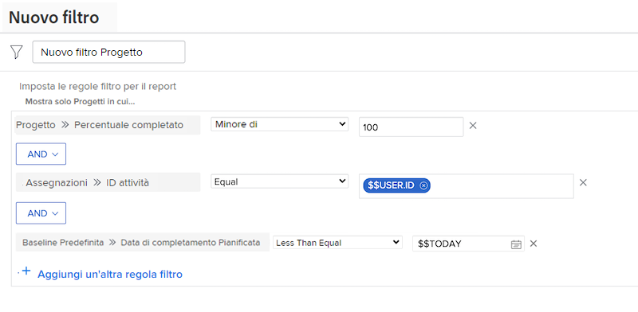

# Creare filtri con caratteri jolly basati su data

Questo video illustra come:

* Sapere quando utilizzare caratteri jolly basati su data
* Comprendere la differenza tra i due caratteri jolly basati su data di Workfront
* Aggiungere un carattere jolly basato su data a un filtro
* Crea una data personalizzata utilizzando caratteri jolly, attributi, operatori e modificatori
* Crea un intervallo di date personalizzato utilizzando i caratteri jolly

>[!VIDEO](https://video.tv.adobe.com/v/336812/?quality=12)

## Domande sull’attività

1. Come si genera la regola di filtro se si desidera che i problemi con una data di scadenza di ieri o oggi?
1. Come si crea la regola di filtro per trovare i progetti che erano previsti la settimana scorsa?
1. Le seguenti regole di filtro fanno parte di un rapporto attività che utilizzi regolarmente. Che tipo di risultati otterreste da questo rapporto?

## Risposte

1. Filtra la data di completamento pianificata dell&#39;emissione tra [!UICONTROL $$OGGI-1d] e [!UICONTROL $$OGGI].
1. Filtra la data di completamento del progetto pianificata tra [!UICONTROL $$OGGIb-1w] e [!UICONTROL $$OGGIe-1w].
1. Questo rapporto individua le attività assegnate che non sono ancora state completate (in altre parole, hanno una percentuale di completamento inferiore a 100) e che sono scadute o scadute oggi. La regola di filtro per la data di completamento pianificata delle attività indica di esaminare le attività con una data di scadenza uguale o precedente alla data odierna.
