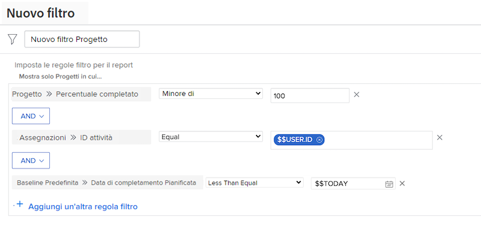

# Creare filtri con caratteri jolly basati sulla data

In questo video scoprirai come:

* Scopri quando utilizzare i caratteri jolly basati sulla data
* Comprendere la differenza tra i due caratteri jolly basati su date di Workfront
* Aggiungere un carattere jolly basato su data a un filtro
* Creare una data personalizzata utilizzando caratteri jolly, attributi, operatori e modificatori
* Creare un intervallo di date personalizzato utilizzando caratteri jolly

>[!VIDEO](https://video.tv.adobe.com/v/3412661/?captions=ita&quality=12&learn=on&enablevpops=0)

## Attività &quot;Creare filtri con caratteri jolly basati su date&quot;

### Domande sull’attività

1. Come creeresti la regola di filtro se volessi ottenere problemi con una data di scadenza di ieri o oggi?
1. Come creeresti la regola di filtro per trovare i progetti che erano in scadenza la settimana scorsa?
1. Le regole di filtro seguenti fanno parte di un rapporto sulle attività da utilizzare regolarmente. Che tipo di risultati otterresti da questo rapporto?

### Risposte

1. Filtra in base alla data di completamento pianificata del problema tra [!UICONTROL $$TODAY-1d] e [!UICONTROL $$TODAY].
1. Filtra per data di completamento pianificata del progetto tra [!UICONTROL $$TODAYb-1w] e [!UICONTROL $$TODAYe-1w].
1. Questo report individua le attività assegnate all&#39;utente che non sono ancora terminate (in altre parole, hanno una percentuale di completamento inferiore a 100) e che sono scadute o scadute oggi. La regola di filtro per la data di completamento pianificata delle attività indica di esaminare le attività con una data di scadenza uguale o precedente alla data corrente.
