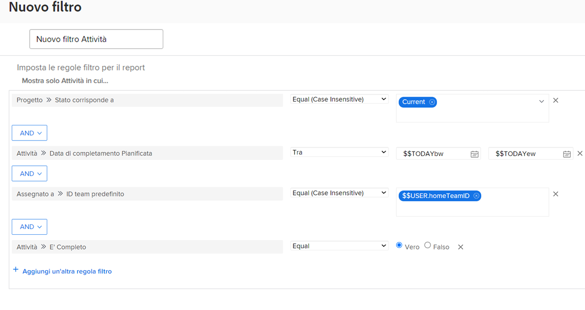

# Creare filtri con caratteri jolly basati sull’utente

In questo video scoprirai come:

* comprendere a cosa servono i caratteri jolly
* Creare un filtro con un carattere jolly basato sull’utente

>[!VIDEO] (https://video.tv.adobe.com/v/3412655/?quality=12&learn=on&enablevpops=0&captions=ita

>[!TIP]
>
>Utilizza il nome e l’origine del campo Utenti dell’assegnazione >> ID durante la creazione di filtri che esaminano le informazioni sulle assegnazioni di attività o problemi.  Questa opzione esamina tutti gli utenti assegnati all’attività o al problema, non solo il &quot;proprietario&quot; o l’assegnatario principale.

>[!TIP]
>
>Utilizza $$USER.ID (invece del tuo nome) anche quando crei filtri per te stesso. In questo modo, se qualcuno vede un filtro che stai utilizzando e dice &quot;condividi con me&quot;, il filtro è già configurato in modo che ogni persona che lo utilizza possa visualizzare le proprie informazioni.

>[!TIP]
>
>È sempre necessario utilizzare il qualificatore del filtro Uguale quando si utilizzano caratteri jolly basati sull’utente.

## Attività &quot;Creare filtri con caratteri jolly basati sugli utenti&quot;

### Attività 1

Questa settimana hai un po&#39; di tempo in più, quindi vuoi vedere se c&#39;è qualcuno nel tuo team che potrebbe usare un po&#39; di assistenza per le sue assegnazioni. Crea un filtro attività per trovare le attività assegnate al team principale in scadenza questa settimana e non ancora completate.

### Risposta 1

Sei fantastico per aiutare i tuoi compagni di squadra! Con il filtro impostato come nell’immagine seguente, troverai le attività:

* Che non sono stati completati (ovvero non hanno uno stato [!UICONTROL Complete] che equivale a [!UICONTROL Complete]);
* che si trovano in progetti con uno stato [!UICONTROL Attuale] (dopo tutto, non desideri trovare attività per progetti che non sono ancora stati avviati);
* che vengono assegnate a qualcuno del team predefinito, come definito dalle impostazioni del team di Workfront;
* E che hanno una data di completamento di questa settimana (questa regola utilizzava il filtro data predefinito per definire &quot;questa settimana&quot;).

Potrebbe essere necessario aggiungere alcuni filtri aggiuntivi desideri limitare ulteriormente l’elenco. Ad esempio, potresti voler aggiungere una regola di filtro che esamini un programma o un portfolio specifico su cui lavora il team.
