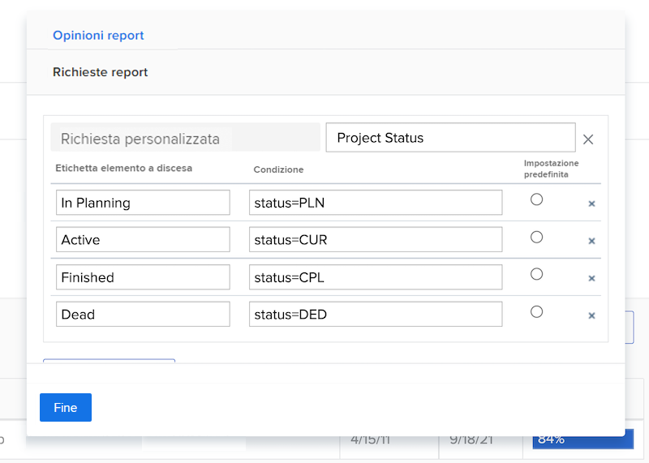
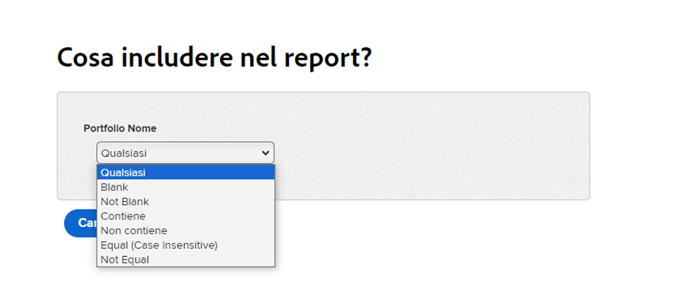
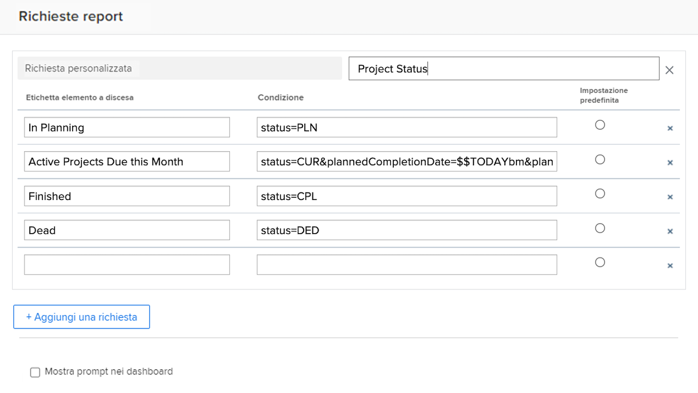

# Creare prompt personalizzati

Questo video illustra:

* Che cos’è un prompt personalizzato
* Come creare un prompt personalizzato utilizzando la modalità testo
* Alcuni esempi che è possibile utilizzare nei rapporti

>[!VIDEO](https://video.tv.adobe.com/v/336822/?quality=12&learn=on)

## Attività: creare prompt personalizzati

1. Crea un prompt personalizzato che mostri i seguenti stati di progetto nel menu a discesa del prompt:
   * In Pianificazione
   * Attuali
   * Completato
   * Morto
1. Modifica il prompt per visualizzare i progetti correnti in scadenza questo mese.

## Risposte

1. I prompt personalizzati devono avere un aspetto simile a questo e la seguente modalità testo:

   

   Dopo aver salvato il prompt personalizzato, il menu a discesa del prompt dovrebbe essere simile al seguente:

1. La modalità testo nel prompt personalizzato deve essere simile alla seguente:



```
   status=CUR&plannedCompletionDate=$$TODAYbm&plannedCompletionDate_Mod=between&plannedCompletionDate_Range=$$TODAYem 
```

L’etichetta a discesa dei prompt attivi deve essere aggiornata per riflettere la modifica nel codice come segue:


