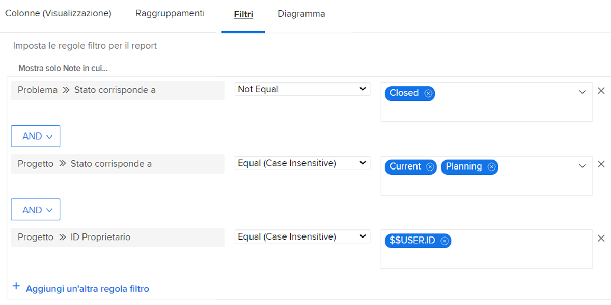
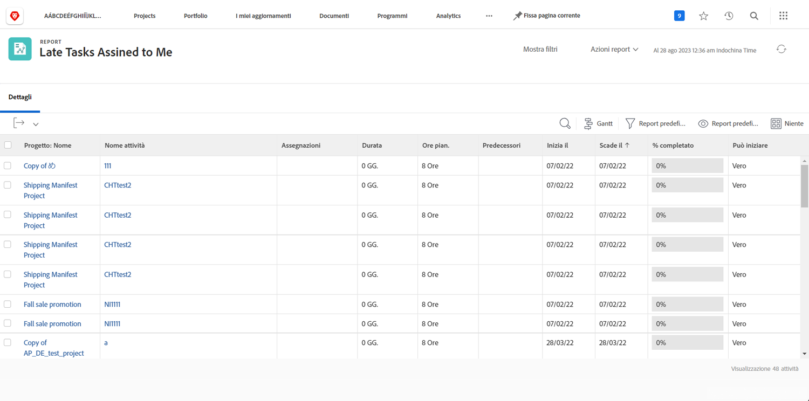

# Esplora i filtri dei problemi incorporati

In questo video:

* Controlla i filtri dei problemi incorporati per vedere come vengono generati
* Scoprire alcuni elementi di reporting utili sui problemi
* Scoprire come creare un filtro di problema personalizzato

>[!VIDEO](https://video.tv.adobe.com/v/336819/?quality=12&learn=on&enablevpops=0)

## Attività &quot;Comprendere i filtri dei problemi incorporati&quot;

### Attività: creare un rapporto sui problemi

Desidere vedere tutti i problemi che devono ancora essere risolti su tutti i progetti attivi di tua proprietà, inclusi i problemi con un oggetto di risoluzione. Crea un report sui problemi e denominalo &quot;Problemi non risolti nei miei progetti&quot;.

### Risposta

Ecco come dovrebbe essere il filtro:

Nel filtro integrato &quot;I miei problemi aperti&quot;, una delle regole di filtro escludeva eventuali problemi in cui era presente un oggetto di risoluzione. Il motivo è che non c&#39;è bisogno di preoccuparsi di questi problemi. Qualcuno ha già creato un progetto, un&#39;attività o un problema che li risolverà, quindi cosa c&#39;è da preoccuparsi? Ma non sono ancora risolti, e nel nostro esempio li includiamo per renderli facili da identificare e controllare come stanno facendo.

A questo scopo, devi aggiungere una colonna nella scheda della vista per &quot;Problema >> Oggetto risolutivo&quot;. Questo mostra il nome dell’oggetto di risoluzione, se ce n’è uno, che si tratti di progetto, attività o problema. Facendo clic sul nome si accede all’oggetto di risoluzione.

È possibile raggruppare l’elenco in base al nome del progetto.

Ecco come si presenterà il rapporto:

