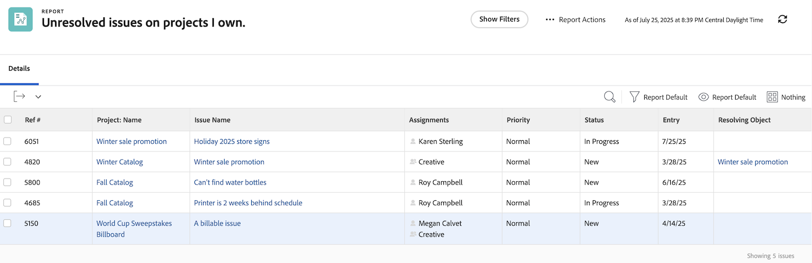

# Informazioni sui filtri dei problemi incorporati

In questo video:

* Esamina i filtri dei problemi incorporati per vedere come sono costruiti
* Scopri alcuni utili elementi di reporting dei problemi
* Scopri come creare un filtro per i problemi

>[!VIDEO](https://video.tv.adobe.com/v/336819/?quality=12)

## Attività: Creare un rapporto sui problemi

Vuoi vedere tutti i problemi che devono ancora essere risolti su tutti i progetti attivi che possiedi, compresi i problemi con un oggetto di risoluzione. Crea un report di problema e denominalo &quot;Problemi irrisolti sui progetti che possiedo&quot;.

## Risposta

Il filtro dovrebbe essere simile a questo:

Nel filtro incorporato &quot;Problemi aperti personali&quot;, una delle regole del filtro ha escluso qualsiasi problema relativo a un oggetto di risoluzione. Il motivo è che non devi preoccuparti di questi problemi. Qualcuno ha già creato un progetto, un compito o un problema che li risolverà, quindi cosa c&#39;è da preoccuparsi? Ma non sono ancora stati risolti e nel nostro esempio li includiamo per facilitarne l’identificazione e il controllo delle operazioni.

A questo scopo, è necessario aggiungere una colonna nella scheda della vista per &quot;Problema >> Risoluzione dell’oggetto&quot;. Viene visualizzato il nome dell&#39;oggetto di risoluzione, se presente, che si tratti di un progetto, un&#39;attività o un problema. Fare clic sul nome per passare all&#39;oggetto di risoluzione.

È possibile raggruppare l’elenco in base al nome del progetto.

Ecco come dovrebbe essere il rapporto:

