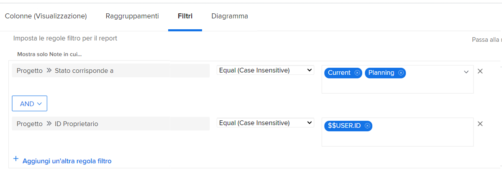

# Comprendere i filtri di progetto incorporati

In questo video scoprirai come:

* Rivedere i filtri di progetto incorporati per capire come vengono generati
* Creare un filtro di progetto personalizzato utilizzando ciò che hai appreso

>[!VIDEO](https://video.tv.adobe.com/v/336817/?quality=12&learn=on)

## Attività &quot;Comprendere i filtri di progetto incorporati&quot;

### Attività: creare un filtro per il progetto

Desideri visualizzare tutti i progetti attivi di tua proprietà, dove “attivo” significa che lo stato del progetto è uguale a Pianificazione o Corrente. Nell’area Progetti, crea un filtro di progetto denominato “Progetti attivi di cui sono proprietario”.

### Risposta

Il filtro deve essere simile al seguente:

Puoi includere regole di filtro aggiuntive, ad esempio per cercare progetti in un determinato programma o portfolio. Dopo una tale operazione, Workfront consiglia di rinominare il filtro in modo che abbia una descrizione appropriata, ad esempio “Progetti attivi di cui sono proprietario nel portfolio marketing”.
