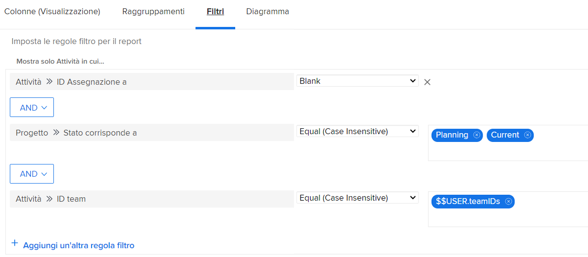
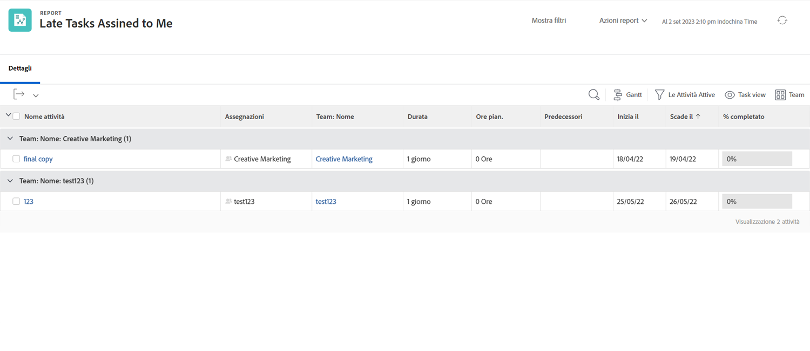

# Informazioni sui filtri di attività incorporati

In questo video:

* Controlla i filtri attività incorporati per vedere come vengono generati
* Scopri alcuni elementi utili per il reporting delle attività
* Scopri come creare un tuo filtro di attività

>[!VIDEO](https://video.tv.adobe.com/v/336818/?quality=12&amp;learn=on&amp;enablevpops=0

## Attività &quot;Comprendere i filtri attività incorporati&quot;

### Attività: creare un rapporto di attività

Vuoi sapere quali sono le attività assegnate a uno dei tuoi team sulle quali nessuno ha ancora accettato di lavorare. Crea un report di attività denominato &quot;Attività non assegnate a uno qualsiasi dei miei team&quot;.

### Risposta

Ecco come dovrebbe essere il filtro:

Imposta la vista a colonne per includere i campi che ti interessano o che desideri poter modificare in linea. Ad esempio, se includi una colonna Assegnazioni, potrai assegnare un membro del team a un’attività direttamente dal rapporto.

Puoi anche raggruppare l’elenco in base al nome del team assegnato a ogni attività.

Ecco come potrebbe apparire il rapporto:

