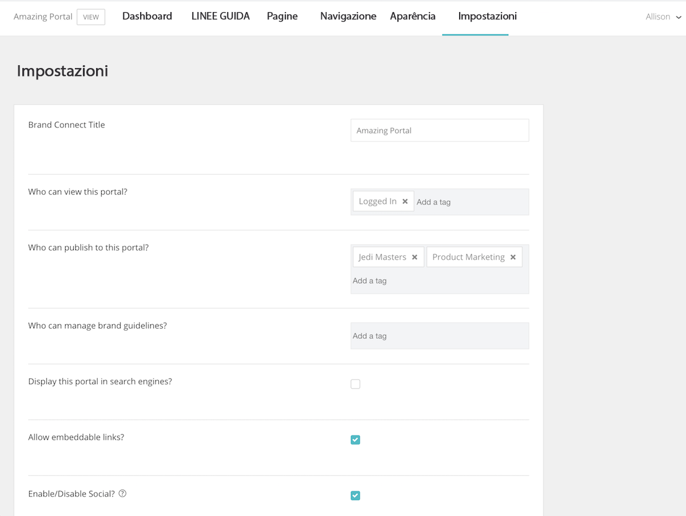

# Stabilire le impostazioni di sistema in [!UICONTROL Brand Connect]

Le impostazioni di [!UICONTROL Brand Connect] controllano chi può visualizzare il portale, chi può pubblicare i contenuti nel portale e chi può gestire le linee guida del brand.

Per accedere alle impostazioni, esegui l’accesso a [!UICONTROL Workfront DAM].

1. Fai clic sull’**icona Impostazioni** nella barra di navigazione e seleziona **[!UICONTROL Brand Connect]**. Oppure fai clic su **[!UICONTROL Brand]** nella barra di navigazione.
1. Quindi fai clic su **[!UICONTROL Modifica]** nell’angolo in alto a destra del pannello [!UICONTROL Brand Connect]. Se la tua organizzazione dispone di più [!UICONTROL Brand Connect], assicurati di modificare quello corretto.

Parla con il tuo consulente di [!UICONTROL Workfront] qualora avessi domande su una di queste impostazioni.

* Titolo **[!UICONTROL Brand Connect]:** Assegna un nome a [!UICONTROL Brand Connect] (o modifica il nome).
* **Chi può visualizzare questo portale?** Imposta i gruppi che possono visualizzare [!UICONTROL Brand Connect]. Ad esempio, se aggiungi il gruppo [!UICONTROL Accesso effettuato], tutti gli utenti che eseguono l’accesso potranno vedere il portale. Tuttavia, le autorizzazioni per le cartelle sono ancora valide; pertanto, anche se un utente può visualizzare il portale, non potrà accedere alle risorse a meno che al gruppo [!UICONTROL Accesso effettuato] non siano state assegnate le autorizzazioni per la cartella.
* **Chi può pubblicare su questo portale?** Imposta i gruppi che possono pubblicare le risorse su [!UICONTROL Brand Connect]. Questi saranno i gruppi collaboratori. Possono pubblicare solo gli elementi a cui hanno accesso.
* **Chi può gestire le linee guida del brand?** Imposta i gruppi che possono gestire le linee guida del brand. La gestione delle linee guida non è limitata agli utenti amministratori. È possibile impostare un gruppo collaboratori per modificare le linee guida.
* **Visualizzare il portale nei motori di ricerca?** Desideri che l’URL di [!UICONTROL Brand Connect] venga visualizzato quando le persone eseguono ricerche su Internet?
* **Consentire collegamenti incorporabili?** I collegamenti incorporabili possono provenire da [!UICONTROL Brand Connect]? In questo modo verrà aggiunto un pannello [!UICONTROL Ottieni collegamenti] al menu [!UICONTROL Condividi], che fornisce collegamenti incorporabili per la risorsa.
* **Abilitare/disabilitare i social network?** Se il social network è abilitato (seleziona la casella), gli utenti possono aggiungere Mi piace e commenti alle risorse.
* **Abilitare/disabilitare il download e il conteggio delle visualizzazioni?** Quando questa opzione è attivata, gli utenti possono vedere quante volte una risorsa è stata scaricata e quanti commenti contiene.
* **Nascondi facet inizialmente:** nasconde i filtri di ricerca dei metadati visualizzati nel pannello di sinistra della pagina [!UICONTROL Risorse].
* **Etichetta Lightbox**: seleziona un’etichetta per [!UICONTROL Lightbox]: [!UICONTROL Lightbox], [!UICONTROL Raccolta], [!UICONTROL Preferiti] o [!UICONTROL Favoriti].
