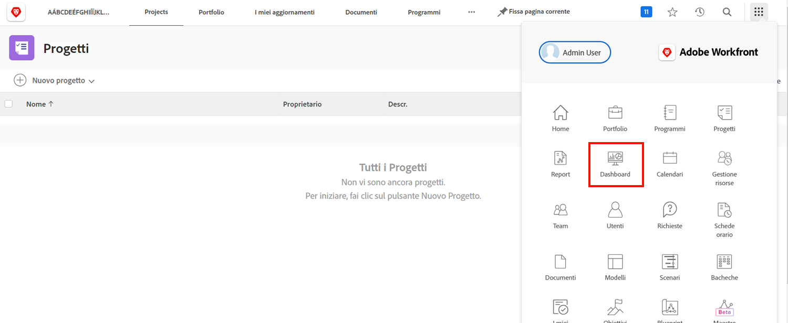
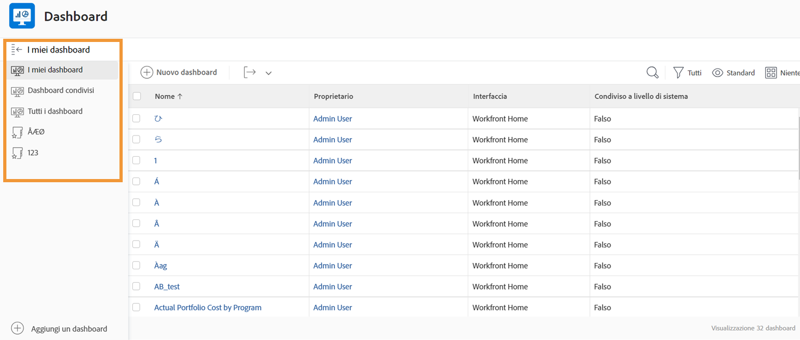
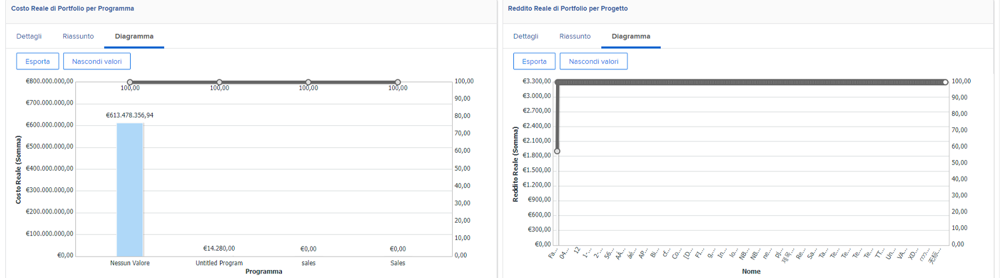
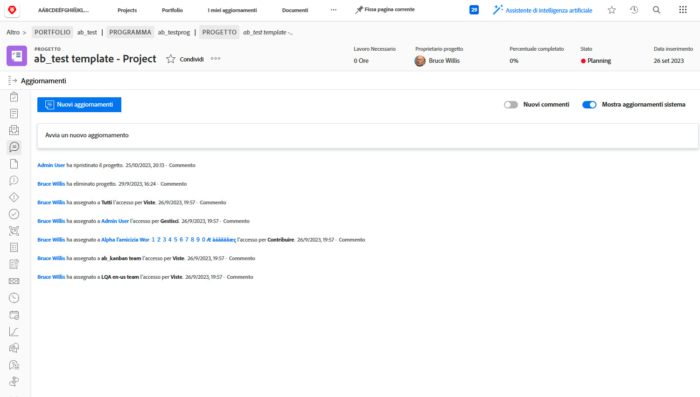
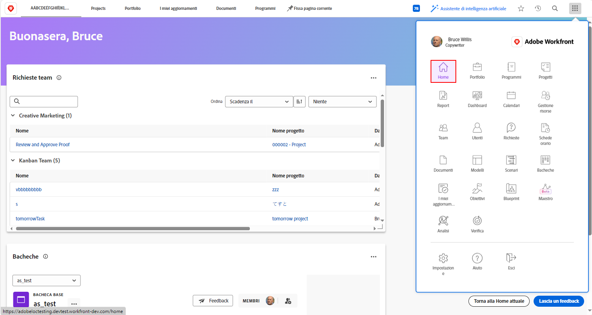

# Workfront per dirigenti

Scopri come Workfront può aiutarti a gestire il lavoro nella tua organizzazione.

In qualità di dirigente, Adobe Workfront può:

* tenerti informato sullo stato di avanzamento del lavoro che ti interessa mediante **rapporti e dashboard**;
* offrirti un modo semplice per **comunicare con le parti interessate del progetto utilizzando gli aggiornamenti**;
* offrirti un modo semplice per **effettuare una richiesta di lavoro**;
* offrirti un modo semplice per visualizzare **elementi in attesa di approvazione**

## Report e dashboard

### Report

I rapporti in Workfront rappresentano la spina dorsale per prendere decisioni migliori, più velocemente. Puoi visualizzarli ovunque tu ti sposti, nell’area progetti, nell’area persone o in una pagina di destinazione dell’attività.

Leader e dirigenti possono accedere all’area dei rapporti per visualizzare quelli personalizzati con informazioni specifiche. Per aumentare la visibilità dei rapporti più importanti, Workfront utilizza le dashboard.

### Dashboard

Utilizzando una dashboard, i leader possono visualizzare e analizzare rapidamente qualsiasi parte del lavoro attualmente svolto dall’organizzazione. La dashboard è semplicemente una raccolta di rapporti che forniscono informazioni che i leader potrebbero dover visualizzare regolarmente. Le dashboard sono completamente personalizzabili in modo che chiunque utilizzi Workfront possa vedere il lavoro che gli interessa.

Fai clic su Dashboard dall’icona del menu principale nell’angolo superiore destro per accedere all’area Dashboard.

I leader possono accedere alle diverse dashboard disponibili dalla navigazione nel pannello a sinistra.

* **Tutte le dashboard**: visualizza le dashboard create da te o da altri utenti e per le quali disponi almeno delle autorizzazioni di visualizzazione.
* **Le mie dashboard**: visualizza le dashboard create.
* **Dashboard condivise**: visualizza le dashboard create da altri utenti e condivise con te.

Grazie a una dashboard, i leader possono esaminare elementi quali “Costi, ricavi e budget” per progetti importanti e problemi aperti di cui i team si occupano. Possono anche vedere progetti a rischio, nonché un elenco di elementi che richiedono l’approvazione dell’esecutivo.

I rapporti in Workfront possono contribuire a responsabilizzare i tuoi dipendenti. La chiave per sfruttare i rapporti è stabilire un flusso di lavoro chiaro per il modo in cui vengono utilizzati dalla tua organizzazione. Assicurati che tutti abbiano una chiara comprensione di quali rapporti vengono utilizzati per misurare il successo.

Esempio di rapporti in una dashboard in Workfront

## Comunicare con le parti interessate del progetto utilizzando gli aggiornamenti

Comunica con il team del progetto all’interno del progetto stesso in modo che tutte le comunicazioni del progetto siano facilmente accessibili.

## Effettuare una richiesta

In molte organizzazioni, il primo passo per avviare un nuovo progetto, sviluppare un nuovo prodotto o creare un risultato finale è effettuare una richiesta in Workfront. Puoi tenere traccia dell’avanzamento della richiesta e fornire informazioni aggiuntive quando necessario.

In questo video scoprirai come:

* Passare all’area richieste
* Effettuare una richiesta
* Visualizzare le richieste inviate

>[!VIDEO](https://video.tv.adobe.com/v/336092/?quality=12&learn=on&enablevpops)

## Elementi in attesa di approvazione

Nella sezione [!UICONTROL Home] puoi trovare facilmente gli elementi in attesa di approvazione.

