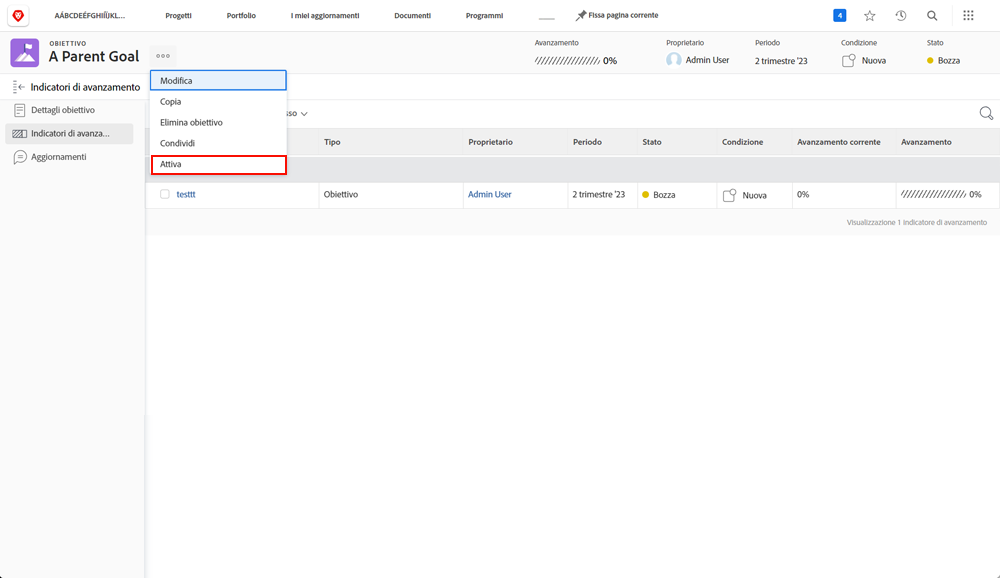

# Attiva allineando un obiettivo a un altro

Quando allinei due obiettivi, uno diventerà l’obiettivo principale e l’altro un obiettivo secondario. Un obiettivo principale può avere più obiettivi secondari, ma un obiettivo secondario può essere allineato solo a un obiettivo principale.

1. Apri l’obiettivo secondario facendo clic sul suo nome nella sezione [!UICONTROL Elenco obiettivi]. Per impostazione predefinita, ci si trova nella sezione [!UICONTROL Dettagli obiettivo] scheda.
1. Fai clic su [!UICONTROL +Aggiungi] pulsante in [!UICONTROL Informazioni obiettivo principale] pannello.

   ![Schermata del [!UICONTROL Dettagli obiettivo] scheda](assets/06-workfront-goals-align-goals.png)

1. Inizia a digitare il nome dell’obiettivo principale desiderato nel [!UICONTROL Obiettivo principale] , quindi selezionarlo quando viene visualizzato nell&#39;elenco. Nell&#39;elenco vengono visualizzati solo gli obiettivi dello stesso periodo o di un periodo futuro.

   ![Schermata del [!UICONTROL Dettagli obiettivo] pannello che mostra [!UICONTROL Informazioni obiettivo principale] pannello](assets/07-workfront-goals-align-to.png)

1. Clic [!UICONTROL Salva modifiche].

L&#39;allineamento di un obiettivo a un altro obiettivo crea un obiettivo figlio. Considera gli obiettivi secondari come obiettivi individuali che contribuiscono al progresso degli obiettivi principali dell’organizzazione o del team. Gli obiettivi secondari possono attivare e influenzare l’avanzamento dell’obiettivo principale.

## Ora attiva l’obiettivo principale

Ora che hai creato un obiettivo figlio, questo diventa un indicatore di avanzamento sull’obiettivo principale. L’opzione Attiva viene visualizzata quando fai clic sul menu a tre punti accanto al nome dell’obiettivo principale.

