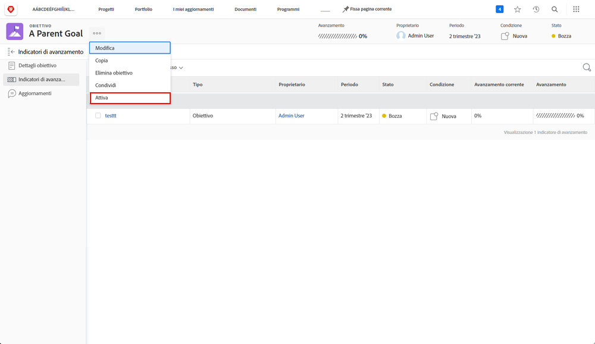

# Attivare allineando un obiettivo a un altro

Quando allinei due obiettivi, uno diventa l’obiettivo principale e l’altro un obiettivo secondario. Un obiettivo principale può avere più obiettivi secondari, mentre un obiettivo secondario può essere allineato a un solo obiettivo principale.

1. Apri l’obiettivo secondario facendo clic sul nome nella sezione [!UICONTROL Elenco obiettivi]. Per impostazione predefinita ti ritroverai nella scheda [!UICONTROL Dettagli obiettivo].
1. Fai clic sul pulsante [!UICONTROL +Aggiungi] nel pannello [!UICONTROL Informazioni obiettivo principale].

   ![Schermata della scheda [!UICONTROL Dettagli obiettivo]](assets/06-workfront-goals-align-goals.png)

1. Inizia a digitare il nome dell’obiettivo principale desiderato nel campo [!UICONTROL Obiettivo principale], quindi selezionalo quando viene visualizzato nell’elenco. Nell’elenco vengono visualizzati solo gli obiettivi dello stesso periodo o di un periodo futuro.

   ![Schermata del pannello [!UICONTROL Dettagli obiettivo] contenente il pannello [!UICONTROL  Informazioni obiettivo principale]](assets/07-workfront-goals-align-to.png)

1. Fai clic su [!UICONTROL Salva modifiche].

Quando si allinea un obiettivo a un altro obiettivo, si crea un obiettivo secondario. Gli obiettivi secondari sono come obiettivi individuali che contribuiscono all’avanzamento degli obiettivi principali dell’organizzazione o del team. Gli obiettivi secondari possono attivare e influenzare l’avanzamento dell’obiettivo principale.

## Ora attiva l’obiettivo principale

Ora che hai creato un obiettivo secondario, questo diventa un indicatore di avanzamento dell’obiettivo principale. L’opzione Attiva viene visualizzata quando fai clic sul menu con tre punti accanto al nome dell’obiettivo principale.

