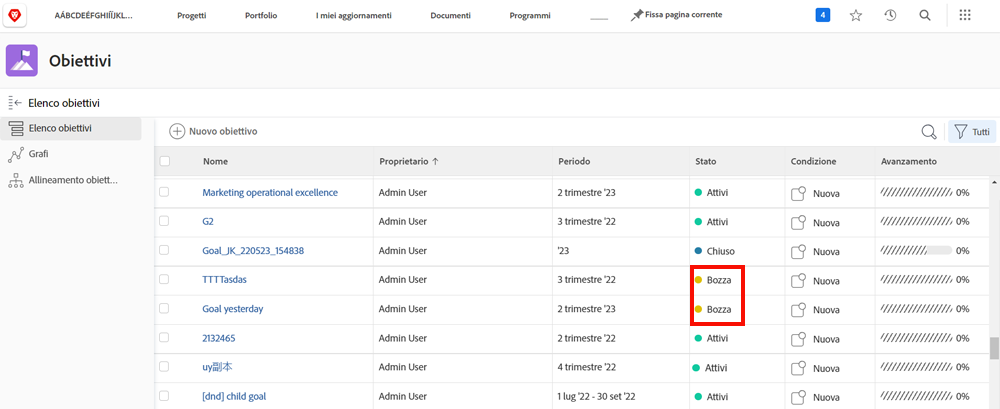
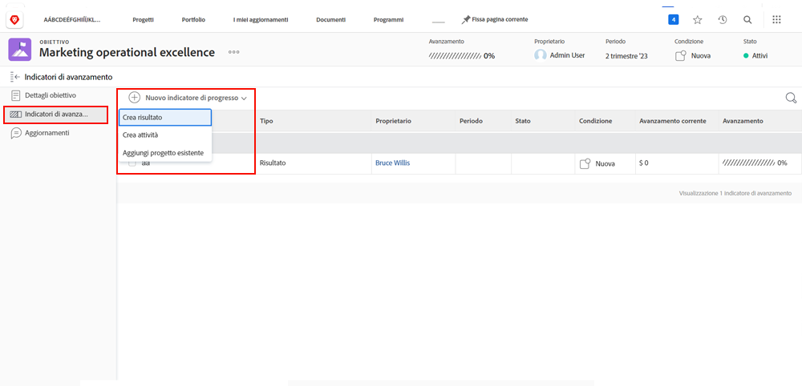

# Attivare gli obiettivi in [!DNL Workfront]

Ora che hai creato gli obiettivi, attiviamoli! Quando crei un obiettivo, viene salvato in [!UICONTROL Bozza] stato. [!UICONTROL Bozza] gli obiettivi non fanno parte della gestione degli obiettivi finché non li attivi. Una volta attivati, passano a un [!UICONTROL Attivo] visualizza lo stato e l’avanzamento nel dashboard e il modo in cui vengono allineati alla strategia complessiva. Obiettivi in [!UICONTROL Attivo] lo stato è associato a un indicatore di avanzamento, in genere un’attività, un risultato, un progetto o un obiettivo allineato (relazione obiettivo figlio-padre).

## Gli indicatori di progresso attivano gli obiettivi

Prima di procedere, è importante comprendere gli indicatori di avanzamento utilizzati in [!DNL Workfront Goals]. Gli indicatori di avanzamento sono gli oggetti in [!DNL Goals] utilizzato per calcolare l&#39;avanzamento di un obiettivo. Gli indicatori di avanzamento sono obiettivi, risultati, attività e progetti allineati. Queste informazioni saranno più dettagliate in seguito. Per il momento è importante comprendere che obiettivi, risultati, attività e progetti allineati devono essere aggiunti a un obiettivo per attivarlo.

Per aggiungere un indicatore di avanzamento aprire l&#39;obiettivo e selezionare la scheda Indicatori di avanzamento a sinistra, quindi il menu a discesa Nuovo indicatore di avanzamento accanto ad esso.

Rispetto ad altri indicatori di progresso, i progetti sono un po &#39;unici, in quanto sono considerati un tipo di attività. Le attività possono essere differenziate in due tipi: barra di avanzamento manuale e progetti. Di conseguenza, anche i progetti generano progressi. Anche se tutti i tipi di indicatori di avanzamento possono essere collegati a un obiettivo padre, è importante tenere presente che esistono differenze nel modo in cui li gestisci.

