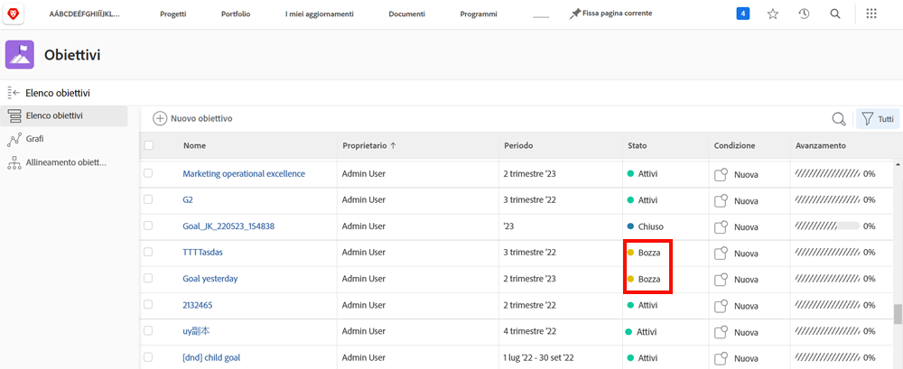
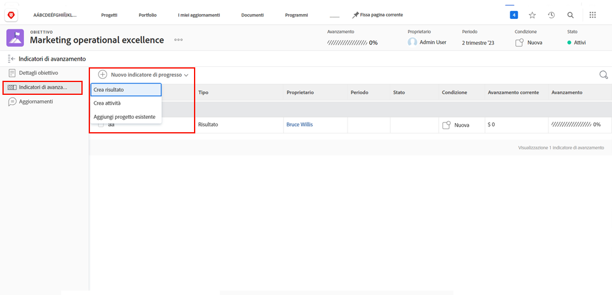
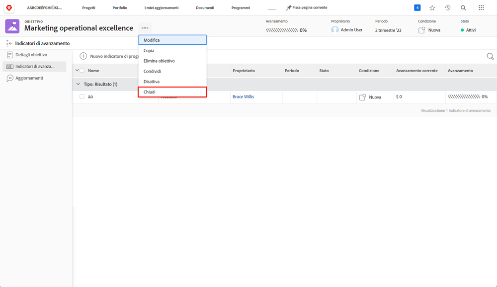

# Attivare gli obiettivi

Ora che hai creato gli obiettivi, attiviamoli. Quando crei un obiettivo, questo viene salvato nello stato di [!UICONTROL Bozza]. Gli obiettivi di [!UICONTROL Bozza] non fanno parte della gestione degli obiettivi finché non li attivi. Una volta attivati, passano allo stato [!UICONTROL Attivo] e mostrano l’avanzamento nella dashboard e il modo in cui si allineano alla strategia generale. Gli obiettivi nello stato [!UICONTROL Attivo] sono associati a un indicatore di avanzamento, in genere un’attività, un risultato, un progetto o un obiettivo allineato (relazione obiettivo secondario/primario).

## Gli indicatori di avanzamento sono necessari per attivare gli obiettivi

Prima di procedere, è importante comprendere gli indicatori di avanzamento utilizzati in [!DNL Workfront Goals]. Gli indicatori di avanzamento sono gli oggetti in [!DNL Goals] utilizzati per calcolare l’avanzamento di un obiettivo. Gli indicatori di avanzamento sono obiettivi, risultati, attività e progetti allineati. In seguito verranno fornite informazioni più dettagliate. Per il momento, è importante comprendere che obiettivi, risultati, attività e progetti allineati devono essere aggiunti a un obiettivo per poterlo attivare.

Per aggiungere un indicatore di avanzamento, apri l’obiettivo e seleziona la scheda Indicatori di avanzamento a sinistra, quindi il menu a discesa Nuovo indicatore di avanzamento accanto a esso.

Rispetto ad altri indicatori di avanzamento, i progetti sono un po’ unici, poiché sono considerati un tipo di attività. Le attività possono essere differenziate in due tipi: Barra di avanzamento manuale e Progetti. Di conseguenza, anche i progetti favoriscono il progresso. Anche se tutti i tipi di indicatori di avanzamento possono essere collegati a un obiettivo principale, è importante tenere presente che ci sono differenze nel modo in cui li gestisci.

## Ora attiva l’obiettivo

Se sull’obiettivo è presente almeno un indicatore di avanzamento, quando fai clic sul menu a tre punti accanto al nome dell’obiettivo viene visualizzata l’opzione Attiva.

