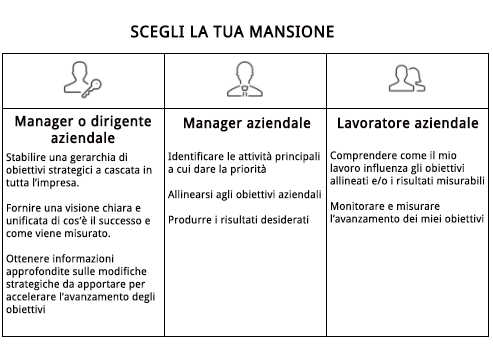

# Configurazione [!UICONTROL Obiettivi Workfront] per la tua organizzazione

*Questa sezione è destinata a [!DNL Workfront] amministratori di sistema responsabili della configurazione degli obiettivi di Workfront per i propri utenti.*

Per garantire un rapido avanzamento dell&#39;organizzazione, è necessario essere certi che l&#39;esecuzione del lavoro sia allineata con la strategia aziendale. [!DNL   Goals] coordina strategie, obiettivi e attività per promuovere l’esecuzione in tutta l’organizzazione e fornire risultati aziendali misurabili.

La best practice per gli obiettivi inizia con obiettivi aziendali di alto livello e quindi si estende a cascata ai livelli di gruppo, team e singoli utenti. Gli obiettivi che ne derivano devono essere allineati, contribuire e sostenere il raggiungimento delle priorità aziendali. In entrata [!DNL Workfront], gli obiettivi sono supportati da risultati o attività che indicano come raggiungerli.

## [!DNL Workfront Goals] elenco di controllo

Prima di poter accedere a, è necessario soddisfare le seguenti condizioni [!DNL   Goals]:

* La tua organizzazione deve acquistare un [!DNL Workfront Goals] licenza, oltre a [!DNL Workfront] licenza.
* La tua organizzazione deve utilizzare il nuovo [!DNL Workfront] interfaccia dell&#39;esperienza. [!DNL Workfront Goals] non è disponibile in Classic [!DNL Workfront] di rete.
* Il tuo [!DNL Workfront Goals] gli utenti devono avere accesso a [!DNL Workfront Goals] nel loro livello di accesso.
* È necessario assegnare un modello di layout che includa [!DNL Workfront Goals] nel menu principale per consentire agli utenti di accedere alle funzionalità.

## Chi può utilizzare [!DNL Workfront Goals]

Anche se i singoli collaboratori hanno spesso obiettivi personali, si consiglia di utilizzare [!DNL Workfront Goals] per supportare il lavoro dell’organizzazione nel raggiungimento degli obiettivi strategici. Tutti i membri dell’organizzazione devono essere incoraggiati a fissare obiettivi in linea con la strategia aziendale complessiva e in linea con le loro attività quotidiane.

Leggi le descrizioni dei ruoli e determina il tuo ruolo in [!DNL Workfront Goals].

Dirigenti e manager possono utilizzare [!DNL Workfront Goals] a:

* Stabilire una gerarchia di obiettivi strategici a cascata in tutta l&#39;azienda.
* Offrire una visione unificata e chiara di come si presenta il successo e come viene misurato.
* Approfondisci quali adeguamenti strategici possono essere effettuati per accelerare la progressione degli obiettivi.

I singoli collaboratori possono utilizzare [!DNL Workfront Goals] a:

* Allinea i loro obiettivi alle iniziative strategiche aziendali generali.
* Misura i loro progressi e i loro risultati in relazione agli obiettivi strategici.
* Regola gli obiettivi personali in base alle esigenze per restare in linea con la direzione aziendale.

