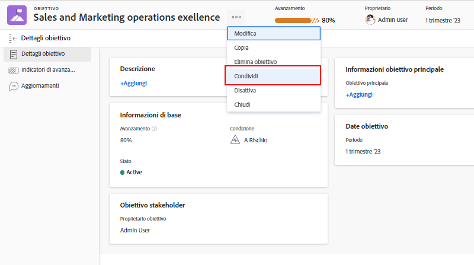

# Comunicare lo stato dell’obiettivo

Ora che hai aggiornato i tuoi obiettivi, prenditi un momento per fare un passo indietro e avere una visione d’insieme degli obiettivi su cui stai lavorando e del modo in cui si collegano agli obiettivi del team, del gruppo e dell’azienda. Comunicare agli altri l’avanzamento e lo stato dei tuoi obiettivi è importante per mantenere tutti i team allineati.

Esistono vari modi per mantenere aggiornate le persone giuste sui tuoi obiettivi. Per iniziare, puoi:

* Condividere e riportare i tuoi obiettivi
* Utilizzare la sezione [!UICONTROL Grafici] per ottenere un’istantanea completa dell’avanzamento dei tuoi obiettivi

## Condividere un obiettivo

Puoi condividere un obiettivo, creato da te o da qualcun altro, per il quale disponi delle autorizzazioni di gestione. Non è possibile condividere obiettivi con gruppi, team o aziende. Se disponi delle autorizzazioni di gestione per un obiettivo, puoi modificarne le autorizzazioni per il creatore dell’obiettivo. Per impostazione predefinita, la persona che crea l’obiettivo dispone delle autorizzazioni di Gestione, ma puoi cambiarle in Visualizzazione.

1. Fai clic sul nome dell’obiettivo da condividere da qualsiasi sezione dell’area [!DNL Goals] per aprire il pannello [!UICONTROL Dettagli obiettivo].

1. Fai clic sul’icona con tre puntini accanto al nome dell’obiettivo, quindi fai clic su [!UICONTROL **Condividi**]. Viene visualizzata la casella [!UICONTROL Accesso obiettivo].

   

1. Esegui una delle operazioni seguenti:

   * Seleziona l’impostazione [!UICONTROL Gestisci a livello di sistema] per concedere autorizzazioni di gestione a chiunque nel sistema abbia accesso in modifica a [!DNL Goals] attraverso il proprio livello di accesso in [!DNL Workfront]. Questa opzione è deselezionata per impostazione predefinita per tutti i nuovi obiettivi.
   * Inizia a digitare il nome dell’utente a cui vuoi dare autorizzazione di [!UICONTROL Gestione] nella casella [!UICONTROL Concedi accesso in gestione a]. Seleziona il nome quando viene visualizzato nel’elenco.

1. Fai clic su [!UICONTROL **Condividi**]. Nel campo [!UICONTROL Accesso in gestione] del pannello [!UICONTROL Dettagli obiettivo], compare un’etichetta “a livello di sistema” o i nomi degli utenti che dispongono delle autorizzazioni di gestione dell’obiettivo.

## Rapporto sulle informazioni sugli obiettivi

Puoi creare rapporti sugli obiettivi o sui progetti che includono informazioni sugli obiettivi associati in [!DNL Workfront]. Esistono diversi modi per visualizzare le informazioni sugli obiettivi nei rapporti.

* Crea un rapporto sugli obiettivi nell’area Rapporti. Puoi visualizzare varie informazioni sull’obiettivo nel rapporto Obiettivo (ad esempio: nome, proprietario, date, avanzamento e così via), che include quanto segue:

   * **Gerarchia obiettivi**: mostra tutti gli obiettivi principali e il modo in cui si connettono tra loro.
   * **È un obiettivo aziendale**: indica se l’organizzazione è designata come proprietaria di un obiettivo.
   * **Tipo di proprietario**: indica se il proprietario di un obiettivo è un utente, un team o un gruppo.

* Crea il rapporto di un progetto che mostri informazioni sugli obiettivi, tra cui:
   * **Gerarchia obiettivi**: mostra tutti gli obiettivi principali e il modo in cui si connettono tra loro.
   * **Obiettivi**: campo di raccolta che visualizza tutti gli obiettivi associati a un progetto.
   * **Numero di obiettivi collegati**: numero di obiettivi associati al progetto.
