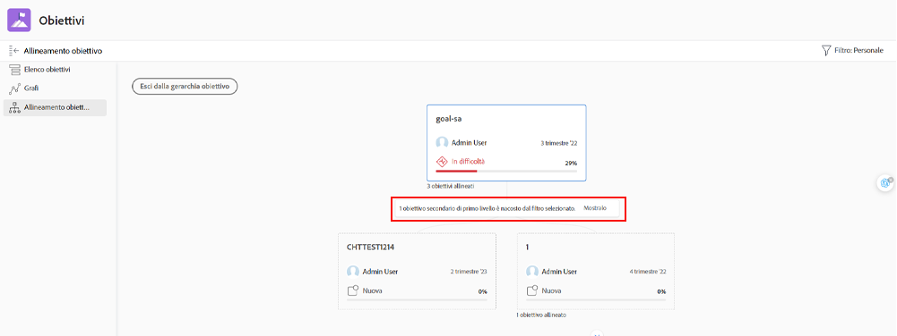

# Visualizzare i singoli aggiornamenti degli obiettivi

Questo video illustra come:

* Visualizza i tuoi obiettivi individuali in [!UICONTROL Pulse] flusso di aggiornamento

>[!VIDEO](https://video.tv.adobe.com/v/335200/?quality=12)

## Filtrare le informazioni nel flusso Pulse

Talvolta potresti notare di ricevere troppe informazioni nel [!UICONTROL Pulse] trasmettere o meno le informazioni corrette. Filtra le informazioni nel feed per visualizzare solo ciò che desideri o di cui hai bisogno.

1. Clic [!UICONTROL **Pulse**] nel pannello a sinistra.
1. Fai clic su [!UICONTROL **Filtro**] nell’angolo in alto a destra.
1. Seleziona un&#39;opzione in base alla quale filtrare. Il filtro Tutti viene applicato per impostazione predefinita e visualizza tutti gli obiettivi nel sistema. È possibile effettuare una delle seguenti operazioni:

   * Seleziona uno dei filtri predefiniti elencati sotto [!UICONTROL Salvato] sezione del pannello filtri, per visualizzare gli obiettivi per i proprietari (ad esempio, [!UICONTROL Tutti], [!UICONTROL Personale], [!UICONTROL I miei team], [!UICONTROL I miei gruppi], e [!UICONTROL Azienda]).
   * Passa il puntatore del mouse sul nome di un filtro, quindi fai clic sul pulsante **Modifica** accanto al nome per personalizzarlo e aggiungere nomi specifici di utenti, team, gruppi o il nome della tua organizzazione.
   * Clic [!UICONTROL **Nuovo filtro**] per creare un nuovo filtro, seleziona dall’elenco di opzioni da personalizzare e filtrare per [!UICONTROL Periodo], [!UICONTROL Stato], [!UICONTROL Avanzamento], e/o [!UICONTROL Proprietario].

   ![Un&#39;immagine del [!UICONTROL Filtri] pannello in [!DNL Workfront Goals]](assets/18-workfront-goals-pulse-stream.png)

**Nota:** La selezione dei filtri viene mantenuta e le informazioni in altre sezioni di [!DNL Goals] viene visualizzato in base a queste informazioni. Puoi individuare e filtrare gli obiettivi in varie sezioni della sezione [!DNL Goals] area in [!DNL Workfront]:

* [!UICONTROL Elenco obiettivi]
* [!UICONTROL Grafi]
* [!UICONTROL Pulse]
* [!UICONTROL Allineamento obiettivo]. In questa sezione puoi visualizzare temporaneamente gli obiettivi che non corrispondono al filtro applicato, in modo da ottenere l’immagine completa di tutti gli obiettivi allineati. Fai clic su [!UICONTROL **Mostra/Mostra**] opzione se il filtro selezionato nasconde obiettivi.

   
