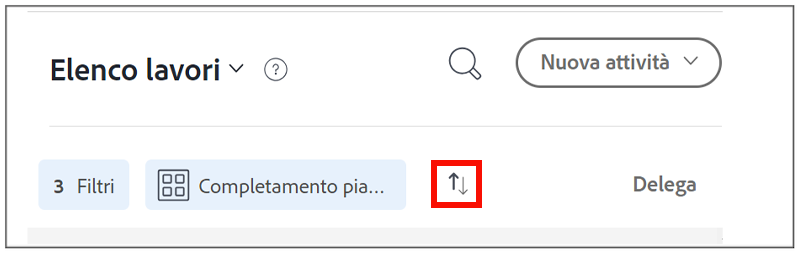

# Organizzare l’elenco attività in [!DNL Workfront] [!UICONTROL Home]

>[!NOTE]
>
>Il [!UICONTROL [!DNL Sort by]] opzione in [!UICONTROL Elenco lavori] è stato rinominato in [!UICONTROL Raggruppa per], e le attività e i problemi possono anche essere raggruppati per le rispettive [!UICONTROL Data Inizio Pianificata].

Questo video illustra come:

* Ordinare le assegnazioni di lavoro
* Filtra assegnazioni di lavoro per tipo
* Identificare il lavoro pronto per iniziare
* Accetta assegnazioni di lavoro

>[!VIDEO](https://video.tv.adobe.com/v/335099/?quality=12&learn=on)

>[!NOTE]
>
>Per impostazione predefinita, le prime voci scadute vengono visualizzate nella parte superiore della sezione [!UICONTROL Elenco lavori]. Se si desidera che gli elementi di lavoro vengano visualizzati in ordine decrescente, fare clic sulle frecce a destra dell&#39;area Raggruppa per.

