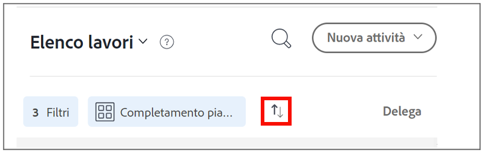

# Organizzare l’elenco delle attività da svolgere nella pagina [!UICONTROL Home] di [!DNL Workfront]

>[!NOTE]
>
>L’opzione [!UICONTROL [!DNL Sort by]] in [!UICONTROL Elenco lavori] è stata rinominata in [!UICONTROL Raggruppa per], e le attività e i problemi possono anche essere raggruppati per la rispettiva [!UICONTROL Data di inizio pianificata].

In questo video scoprirai come:

* Ordinare le assegnazioni di lavoro
* Filtrare le assegnazioni di lavoro per tipo
* Individuare i lavori pronti per iniziare
* Accettare le assegnazioni di lavoro

>[!VIDEO](https://video.tv.adobe.com/v/335099/?quality=12&learn=on&enablevpops=1)

>[!NOTE]
>
>Per impostazione predefinita, gli elementi più prossimi alla scadenza vengono visualizzati nella parte superiore dell’[!UICONTROL Elenco lavori]. Se desideri che gli elementi di lavoro vengano visualizzati in ordine decrescente, fai clic sulle frecce a destra dell’area Raggruppa per.

