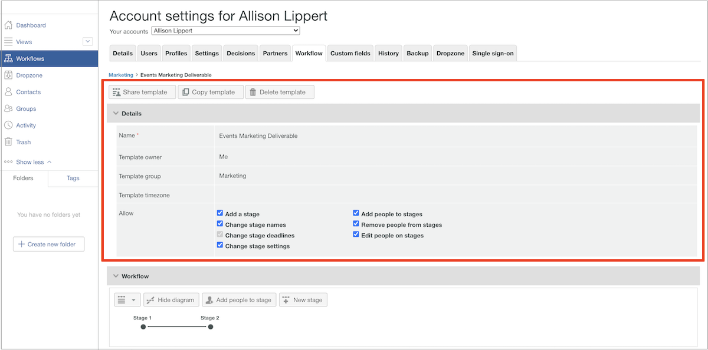

# Modificare un modello di flusso di lavoro automatizzato

Man mano che i processi di revisione e approvazione delle bozze vengono perfezionati o che vengono apportate modifiche organizzative, i modelli di flusso di lavoro automatizzati devono essere aggiornati per riflettere le operazioni correnti dei team che utilizzano Workfront.

Mantenere aggiornati i modelli garantisce la coerenza dei processi di revisione e approvazione, oltre a risparmiare tempo a coloro che caricano le bozze, perché non devono modificare costantemente un flusso di lavoro.

1. Seleziona **[!UICONTROL Bozza]** dal **[!UICONTROL Menu principale]** in [!DNL Workfront].
1. Da qui, seleziona **[!UICONTROL Flussi di lavoro]** nel menu del pannello a sinistra.
1. Fai clic sul menu a 3 punti all’estrema destra del nome del modello e seleziona **[!UICONTROL Visualizza dettagli modello]**.

Le opzioni per condividere, copiare ed eliminare il modello si trovano nella parte superiore della finestra dei dettagli del modello per ciascun modello. L’eliminazione di un modello non influisce sulle bozze in corso a cui è applicato il modello, ma significa che il modello non è più disponibile per l’uso.

Fare clic sulla freccia a sinistra della parola &quot;[!UICONTROL Dettagli]&quot; per espandere o comprimere la sezione.

## Apportare modifiche alle fasi e ai destinatari

Potrebbero essere necessarie modifiche nell’area [!UICONTROL Flusso di lavoro] in cui per processo semplificato si intende una scadenza precedente o quando qualcuno si unisce al team e rivedrà le bozze.

Ogni fase di un flusso di lavoro automatizzato ha una propria sezione, che consente di modificare in modo indipendente scadenze, privacy, destinatari della bozza e altre informazioni.

Questo video illustra alcune delle modifiche che è possibile apportare nell&#39;area [!UICONTROL Flusso di lavoro]. Consulta l’elenco puntato in questo video, che esamina queste impostazioni.

>[!VIDEO](https://video.tv.adobe.com/v/335131/?quality=12&learn=on)

In qualità di revisore, ecco le modifiche che puoi apportare al modello di bozza nella sezione [!UICONTROL Flusso di lavoro]:

* Fai clic sul campo del nome dell’area di visualizzazione o sul campo della scadenza per aggiornare tali informazioni.
* Fai clic sulla freccia a sinistra della scadenza per bloccare la fase, determinare quando viene attivata o richiedere una sola decisione.
* Nell’elenco dei destinatari, fai clic sui campi [!UICONTROL Ruolo] o [!UICONTROL Avvisi e-mail] per selezionare un’altra opzione.
* Passa al menu a 3 punti all’estrema destra del nome di un destinatario per eliminarlo dall’elenco, impostarlo come decisore principale per la fase del flusso di lavoro o modificare il ruolo della bozza e le informazioni dell’avviso e-mail.
* Sono disponibili due opzioni per aggiungere i destinatari all’elenco.
   1. Nell&#39;angolo in alto a destra di ogni sezione della fase, vai al menu [!UICONTROL Altro] e seleziona [!UICONTROL Aggiungi persone alla fase]. Dopo aver aperto la finestra [!UICONTROL Aggiungi persone all&#39;area di visualizzazione], fare clic sull&#39;area di visualizzazione a cui aggiungerle. Quindi inserisci il nome o l’indirizzo e-mail nell’elenco dei destinatari e assegna un ruolo di bozza e un avviso e-mail. Al termine, fai clic sul pulsante [!UICONTROL Aggiungi persone].
   1. Nella parte superiore dell’area [!UICONTROL Flusso di lavoro], seleziona [!UICONTROL Aggiungi persone alla fase].

## Condivisione dei modelli

L’area [!UICONTROL Condiviso con] visualizza gli utenti della bozza che possono utilizzare il modello. Per rimuovere gli utenti che non devono più utilizzare il modello, fai clic sul menu a 3 punti all’estrema destra del nome e seleziona [!UICONTROL Rimuovi].

Elenco ![[!UICONTROL Condiviso con]](assets/proof-system-setups-edit-template-shared-with.png)

Tuttavia, non puoi aggiungere persone all’elenco di condivisione da questa sezione. A questo scopo, torna all’inizio della finestra dei dettagli del modello e fai clic sul pulsante [!UICONTROL Condividi modello].

## Informazioni aggiuntive

[!DNL Workfront] mantiene una cronologia di audit relativa a quando sono state apportate modifiche al modello. Puoi visualizzare la data, chi ha apportato la modifica e alcune brevi informazioni su quali modifiche sono state apportate.

Questa sezione non registra informazioni relative a quando il modello è stato utilizzato sulle bozze.

