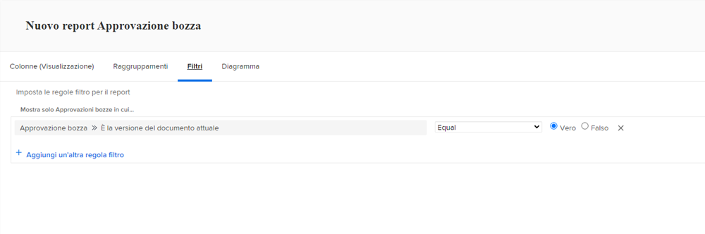
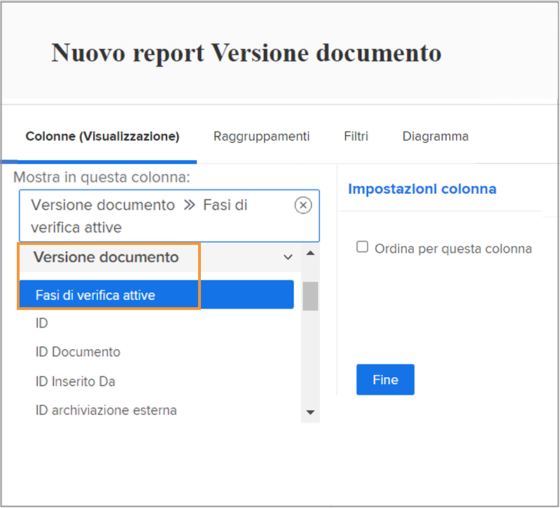
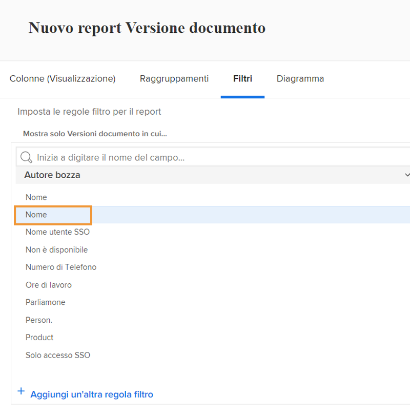

# Rapporto sulle bozze

Le funzionalità delle bozze digitali di [!DNL Workfront] consentono di gestire i progetti e i relativi flussi di lavoro di revisione in un’unica posizione: [!DNL Workfront]. Ottieni informazioni utili sul lavoro di bozza svolto con i tipi di rapporto, le origini dei campi e i nomi dei campi che mostrano le informazioni di revisione e approvazione.

Ti consigliamo di lavorare con il consulente di [!DNL Workfront] per creare rapporti che soddisfino i requisiti dell’organizzazione. Alcuni dei rapporti richiedono familiarità con il reporting in modalità testo di [!DNL Workfront].

Inizia con questi rapporti standard di base per aiutare i team a gestire le bozze attraverso un processo di revisione e approvazione in [!DNL Workfront].

## [!UICONTROL Approvazione bozza]

Questo tipo di rapporto consente di tenere traccia delle approvazioni bozza in sospeso per garantire il rispetto delle scadenze.

![Seleziona [!UICONTROL Approvazione bozza] dal menu a discesa [!UICONTROL Nuovo rapporto]](assets/proof-system-setups-proof-approval-report.png)

Le opzioni di visualizzazione e di filtro includono la [!UICONTROL data della decisione], l’[!UICONTROL  approvazione bozza], la [!UICONTROL fase di approvazione], il [!UICONTROL modello di flusso di lavoro] e le [!UICONTROL informazioni sul richiedente]. Con il reporting in modalità testo è possibile creare un raggruppamento che organizza l’elenco in base al nome del documento. Consulta [Comprendere la modalità testo di base per i raggruppamenti](https://experienceleague.adobe.com/docs/workfront-learn/tutorials-workfront/reporting/intermediate-reporting/basic-text-mode-for-groupings.html?lang=it).

Quando scrivi rapporti di approvazione bozza, assicurati di ricevere informazioni relative alla versione più recente delle bozze. [!DNL Workfront] consiglia di includere questa origine e questo nome del campo nel filtro:

**[!UICONTROL Approvazione bozza]>>[!UICONTROL È la versione del documento corrente]**

Ciò è utile quando stai generando rapporti su bozze che hanno più versioni in modo che il rapporto elenchi solo la versione corrente di ogni bozza che necessita di approvazione. Questo filtra le versioni precedenti su cui non è più necessario lavorare.

## [!UICONTROL Versione documento]

Questo tipo di rapporto consente di gestire e tenere traccia delle versioni di [!DNL Workfront].

![Seleziona [!UICONTROL Versione documento] dal menu a discesa [!UICONTROL Nuovo rapporto]](assets/proof-system-setups-document-version-report.png)

Le opzioni di visualizzazione includono informazioni da: [!UICONTROL Versione documento], [!UICONTROL Documento], [!UICONTROL Immesso da], [!UICONTROL Stato approvazione bozza], [!UICONTROL Autore bozza], e [!UICONTROL Provider di documenti].

I raggruppamenti possono essere eseguiti da [!UICONTROL Versione documento], [!UICONTROL Immesso da], [!UICONTROL Stato approvazione bozza] o informazioni sul proprietario della bozza.

I filtri includono [!UICONTROL Versione documento], [!UICONTROL Livello di accesso], [!UICONTROL Documento], [!UICONTROL Immesso da], [!UICONTROL Stato approvazione bozza], [!UICONTROL Autore bozza] e informazioni sul provider di documenti.

È possibile visualizzare il nome della fase di bozza attualmente attiva per ogni documento del rapporto con questa colonna in una vista:

**[!UICONTROL Versioni documento] >> [!UICONTROL Fasi di bozza attive]**

Se non è attiva alcuna fase, la colonna è vuota.

Anche questa origine campo >> nome campo è disponibile come filtro in un rapporto.

Utilizza l’origine campo [!UICONTROL Autore bozza] per segnalare informazioni sull’utente che ha creato la bozza. Scegli l’origine campo [!UICONTROL Nome] per visualizzare il nome dell’autore della bozza in una vista.

**[!UICONTROL Creatore della bozza] >> [!UICONTROL Nome]**

Anche questa combinazione di origine campo >> nome campo è disponibile come filtro.

<!--
Learn More Icon
Learn how to create reports in [!DNL Workfront] with the Report Creation class.
Access to proofing functionality
-->
