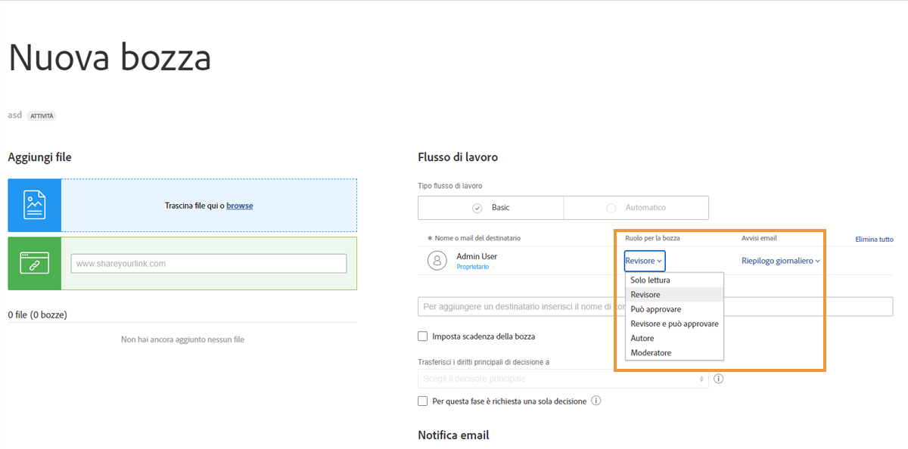
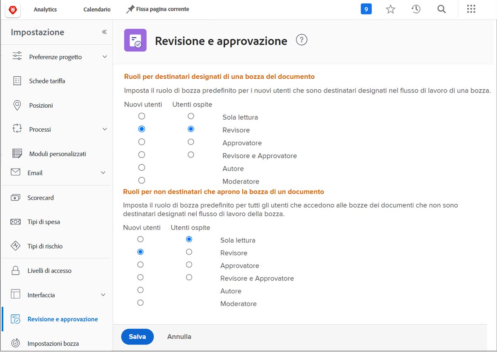

# Impostare ruoli di bozza predefiniti

La prima impostazione predefinita da completare consiste nel determinare un ruolo di bozza predefinito che verrà assegnato quando vengono creati nuovi utenti o si apre una bozza.

I ruoli di bozza determinano ciò che un utente è in grado di fare con una bozza: basta guardarla, fare commenti, approvarla, ecc. [!DNL Workfront] consiglia di impostare le impostazioni predefinite del ruolo di bozza per tutti gli utenti, per rendere più rapida e semplice l&#39;aggiunta di destinatari alle bozze e l&#39;impostazione di flussi di lavoro.

Tuttavia, questo ruolo di bozza predefinito può essere modificato durante il caricamento delle singole bozze, affinché tutti possano svolgere il ruolo richiesto nel processo di revisione e approvazione.

## Impostare ruoli di bozza predefiniti

1. Seleziona **Configurazione** dal [!UICONTROL Menu principale].
1. Seleziona **Revisione e approvazione** dal menu a sinistra.
1. Fai clic sul pulsante accanto al ruolo di bozza predefinito desiderato sia per i nuovi utenti di [!DNL Workfront] che per gli utenti di bozze guest per “destinatari designati”: tutti gli utenti che vengono aggiunti al flusso di lavoro di bozza, manualmente o tramite un modello di flusso di lavoro.
1. Fai clic sul pulsante accanto al ruolo di bozza predefinito desiderato sia per i nuovi utenti di [!DNL Workfront] che per gli utenti di bozze guest per gli utenti “non destinatari”. Questi sono generalmente utenti di [!DNL Workfront] che hanno accesso a una bozza ma non sono una delle persone assegnate al flusso di lavoro.
1. Salva le modifiche.

Considera cosa dovrà fare la maggior parte dei tuoi utenti e guest quando verranno aggiunti a un flusso di lavoro di bozza. Questo dovrebbe essere il tuo valore predefinito.

## Best Practice

| Best Practice | Ecco perché |
|---|---|
| Utilizza esclusivamente l’impostazione di Workfront Solo lettura o Revisore per “Ruoli non destinatari che aprono la bozza di un documento”. | Le altre opzioni per questa impostazione richiedono tutte una Decisione bozza, che può ostacolare il flusso di lavoro di bozza. In genere, le persone non aggiunte al flusso di lavoro di bozza devono solo visualizzarla o aggiungere commenti, non devono approvarla, pertanto le opzioni Sola lettura o Revisore sono la scelta migliore.   Nota: questa impostazione si trova nel menu principale di Workfront > Configurazione > Revisione e approvazione. |
