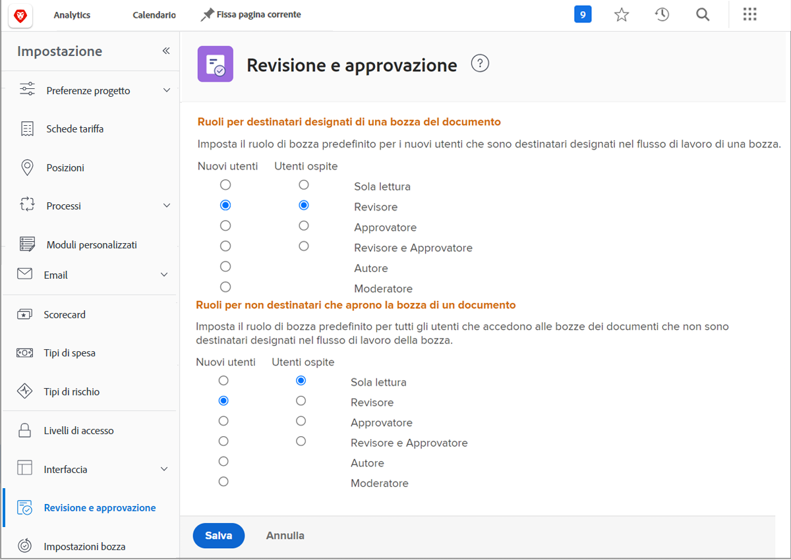

# Imposta i ruoli bozza predefiniti

<!---
21.4 updates have been made
--->

La prima impostazione predefinita da completare consiste nel determinare un ruolo di bozza predefinito che verrà assegnato quando vengono creati nuovi utenti o si apre una bozza.

I ruoli di bozza determinano ciò che un utente è in grado di fare con una bozza: basta guardarla, fare commenti, approvarla, ecc. [!DNL Workfront] consiglia di impostare le impostazioni predefinite del ruolo bozza per tutti gli utenti, in modo da velocizzare e semplificare l’aggiunta di destinatari alle bozze e la configurazione dei flussi di lavoro.

Tuttavia, questo ruolo di bozza predefinito può essere modificato durante il caricamento delle singole bozze, affinché tutti possano svolgere il ruolo richiesto nel processo di revisione e approvazione.

## Imposta i ruoli bozza predefiniti

1. Seleziona **Configurazione** dal [!UICONTROL Menu principale].
1. Seleziona **Revisione e approvazione** dal menu a sinistra.
1. Fai clic sul pulsante accanto al ruolo di bozza predefinito desiderato per entrambe le nuove [!DNL Workfront] utenti e utenti di bozze guest per &quot;destinatari designati&quot;: tutti gli utenti che vengono aggiunti al flusso di lavoro della bozza, manualmente o tramite un modello di flusso di lavoro.
1. Fai clic sul pulsante accanto al ruolo di bozza predefinito desiderato per entrambe le nuove [!DNL Workfront] utenti e utenti di prova ospiti per utenti &quot;non destinatari&quot;. Questi sono generalmente [!DNL Workfront] utenti che hanno accesso a una bozza ma non sono una delle persone assegnate al flusso di lavoro.
1. Salva le modifiche.

Considera cosa dovrebbero fare la maggior parte degli utenti e degli ospiti quando vengono aggiunti a un flusso di lavoro di verifica. Questo dovrebbe essere il tuo valore predefinito.
