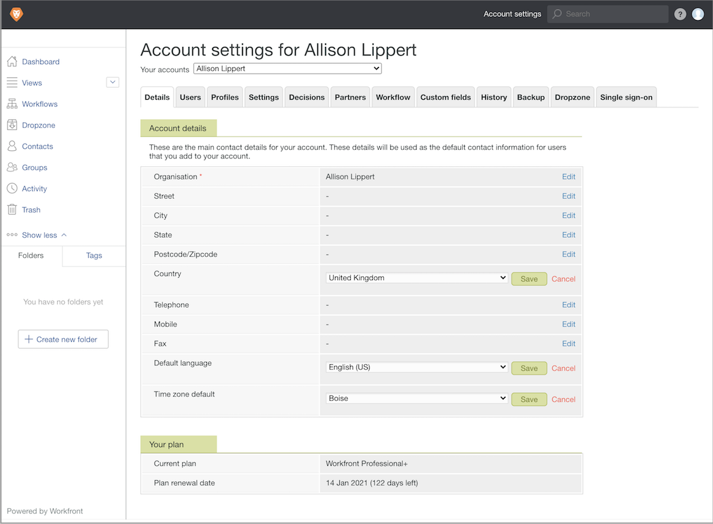

# Imposta le impostazioni predefinite dell&#39;account della bozza

Stabilire le impostazioni account predefinite che si applicano globalmente a tutte le bozze e agli utenti che eseguono la correzione (paese, lingua e fuso orario). Se hai utenti in più fusi orari o paesi, puoi modificare queste impostazioni sul profilo utente di ciascun individuo, se necessario.

1. Seleziona **[!UICONTROL Copertura]** da [!DNL Workfront’s] [!UICONTROL Menu principale].
1. Seleziona **[!UICONTROL Impostazioni account]** nella barra di navigazione superiore.
1. Seleziona la **[!UICONTROL Dettagli]** scheda .
1. Vai a [!UICONTROL Paese] campo e seleziona **[!UICONTROL Modifica]**. Scegli il paese in cui la maggior parte degli utenti di correzione si trovano come impostazione predefinita.
1. Seleziona **[!UICONTROL Salva]** per quella impostazione.
1. Vai a [!UICONTROL Lingua predefinita] campo e seleziona **[!UICONTROL Modifica]**. Scegli la lingua che la maggior parte degli utenti di correzione utilizzerà come impostazione predefinita.
1. Seleziona **[!UICONTROL Salva]** per quella impostazione.
1. Vai a [!UICONTROL Impostazione predefinita del fuso orario] campo e seleziona **[!UICONTROL Modifica]**. Scegli il fuso orario in cui la maggior parte degli utenti della correzione sarà visualizzata come impostazione predefinita. Questo è il fuso orario riconosciuto dai flussi di lavoro di prova configurati manualmente. Si applica anche ai modelli di flusso di lavoro di bozza, ma ogni modello può avere un fuso orario impostato.
1. Seleziona **[!UICONTROL Salva]** per quella impostazione.
