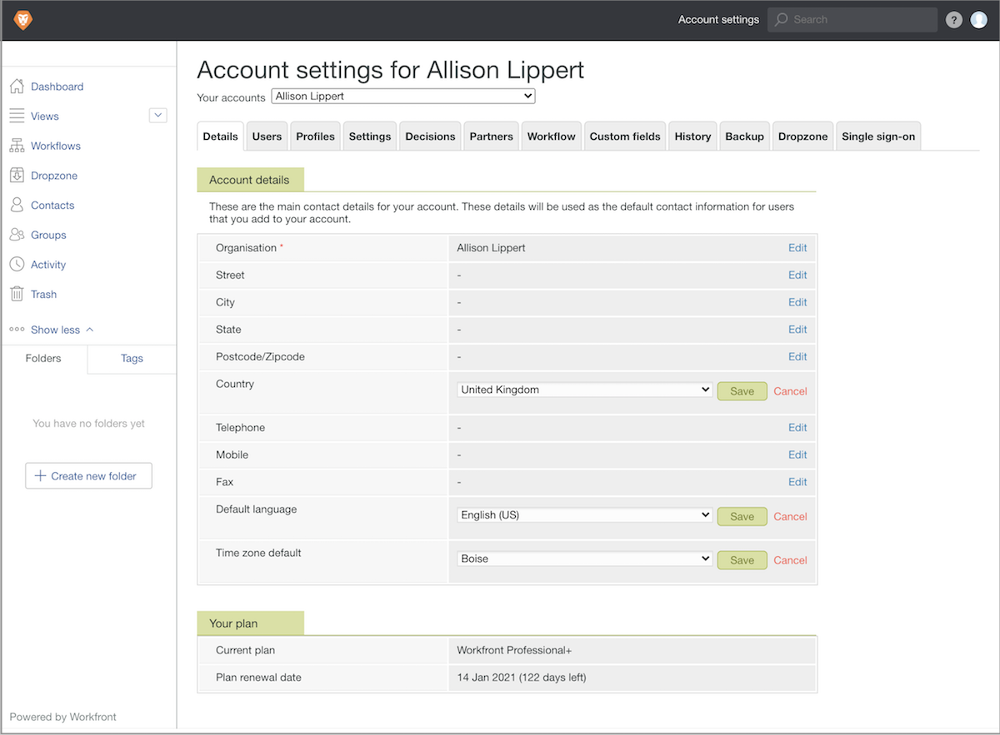

# Configurare le impostazioni predefinite dell’account della bozza

Definisci le impostazioni account predefinite da applicare globalmente a tutte le bozze e a tutti gli utenti che si occupano della verifica delle bozze: paese, lingua e fuso orario. Se gli utenti dispongono di più fusi orari o paesi, puoi modificare queste impostazioni sul profilo utente di ogni singolo utente, se necessario.

1. Seleziona **[!UICONTROL Bozza]** dal [!DNL Workfront's] [!UICONTROL Menu principale].
1. Seleziona **[!UICONTROL Impostazioni account]** nella barra di navigazione superiore.
1. Seleziona la scheda **[!UICONTROL Dettagli]**.
1. Passa al campo [!UICONTROL Paese] e seleziona **[!UICONTROL Modifica]**. Scegli il paese in cui si trovano la maggior parte degli utenti che si occupano della verifica delle bozze come impostazione predefinita.
1. Seleziona **[!UICONTROL Salva]** per tale impostazione.
1. Passa al campo [!UICONTROL Lingua di default] e seleziona **[!UICONTROL Modifica]**. Scegli la lingua predefinita dalla maggior parte degli utenti che si occupano della verifica delle bozze.
1. Seleziona **[!UICONTROL Salva]** per tale impostazione.
1. Passa al campo [!UICONTROL Fuso orario predefinito] e seleziona **[!UICONTROL Modifica]**. Scegli il fuso orario predefinito in cui si troverà la maggior parte degli utenti che si occupano della verifica delle bozze. Questo sarà il fuso orario riconosciuto dai flussi di lavoro di bozza configurati manualmente. Si applica anche ai modelli di flusso di lavoro della bozza, ma per ogni modello può essere impostato un fuso orario.
1. Seleziona **[!UICONTROL Salva]** per tale impostazione.

## Best Practice

| Best Practice | Ecco perché |
|---|---|
| Regola le impostazioni di back-end della bozza in modo che gli utenti possano visualizzare le scadenze in un formato di 12 ore. | Selezionare l&#39;opzione F j, Y, gi:a nelle impostazioni della bozza per gli utenti che desiderano visualizzare le scadenze/ore della bozza in formato AM/PM. Per le aree geografiche che utilizzano le 12 ore, questo aiuta a chiarire le scadenze.   Nota: questa impostazione si trova nel menu principale di Workfront > Bozza > Impostazioni account > Utenti > e modificando il campo Formato data per ciascun utente. |
| Stabilisci una scadenza bozza predefinita come parte delle impostazioni di sistema. | Quando viene impostata una scadenza bozza predefinita (data di caricamento + numero x di giorni lavorativi), se il creatore della bozza dimentica di aggiungere una scadenza, Workfront applica automaticamente questa scadenza a ogni bozza caricata.   Nota: questa impostazione si trova nel Menu principale di Workfront > Bozza > Impostazioni account > Impostazioni > Valori predefiniti bozza > campo Scadenza (+ giorni lavorativi). |
| Nascondi l’opzione Non pertinente nella Decisione bozza. | Questa opzione di decisione causa spesso confusione tra gli approvatori, in quanto le organizzazioni non definiscono sempre quando utilizzare l’opzione Non pertinente. L’opzione Non pertinente indica in genere che la bozza non è pertinente per il destinatario della stessa, a cui non è richiesto di prendere una decisione di approvazione o rifiuto. La selezione di Non pertinente consente al flusso di lavoro di bozza di proseguire.   L’opzione Non pertinente non è necessaria nella maggior parte dei flussi di lavoro di bozza.   Nota: questa impostazione si trova nel menu principale di Workfront > Bozza > Impostazioni account > Decisioni. |
| Non riordinare le opzioni di Decisione bozza nelle impostazioni bozza. | Ogni impostazione di decisione bozza contiene un valore/peso specifico che, se riordinato, può generare confusione nelle configurazioni della bozza. L’ordine di decisione e il valore/peso vengono utilizzati come trigger di attivazione della fase di bozza e nel reporting.   Nota: questa impostazione si trova nel menu principale di Workfront > Bozza > Impostazioni account > Decisioni. |
| Definisci le impostazioni predefinite per i ruoli bozza e gli avvisi e-mail. | Queste impostazioni vengono compilate automaticamente durante l’assegnazione di un flusso di lavoro di bozza, velocizzando il processo e contribuendo alla coerenza tra i flussi di lavoro di bozza.   Nota: le impostazioni predefinite dell’utente si trovano nel Menu principale di Workfront > Bozza > Impostazioni account > Utenti > e selezionando l’utente per cui impostarle. |
