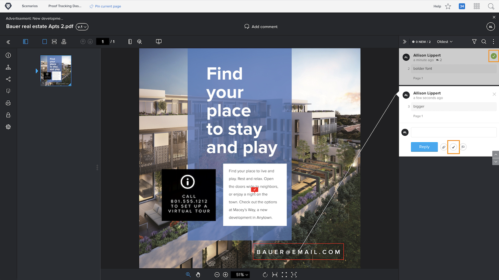

# Gestire i commenti della bozza

[!DNL Workfront] consente di tenere traccia e gestire il lavoro relativo a ogni commento su una bozza, ad esempio per apportare correzioni alla risorsa, con azioni di commento o risolvendo i commenti.

Le azioni di prova sono un &quot;flag&quot; o un &quot;etichetta&quot; su un commento e sono spesso utilizzate per indicare che è stata intrapresa o che è necessario adottare un’azione riguardo al commento. Le azioni possono essere selezionate dall’icona o dal menu Altro di ciascun commento.

Ad esempio, l’utente è responsabile di decidere quali delle correzioni apportate durante il processo di revisione devono essere effettivamente eseguite. Utilizzando un’azione, è possibile contrassegnare i commenti rilevanti, consentendo a un designer o a un editor di sapere quali revisioni apportare. Tale persona può quindi utilizzare un’altra azione per indicare che le modifiche sono state apportate.

![Immagine di una bozza nel visualizzatore di correzione con il [!UICONTROL Da fare] azione bozza evidenziata nel commento.](assets/manage-comments-2.png)

Se nei commenti non sono elencate le azioni, l’organizzazione non le ha configurate. Se ritieni che le azioni siano qualcosa che l&#39;organizzazione deve utilizzare, rivolgiti all&#39;amministratore del sistema di correzione.

La funzione &quot;risolvi commento&quot; viene comunemente utilizzata per indicare che un commento è stato affrontato in qualche modo: è stata apportata una correzione o è stata data risposta a una domanda. Alcuni [!DNL Workfront] i clienti &quot;risolvono&quot; un commento quando si tratta di una correzione che non è necessario apportare o si tratta solo di un commento che è stato letto.

Per risolvere il commento, fai clic sull’icona del segno di spunta. Questo consente di inserire un segno di spunta verde nel commento, facilitando l’identificazione dei commenti che sono stati rivisti durante la scansione della colonna dei commenti.

Puoi filtrare la colonna dei commenti in base a entrambe le funzioni, in modo da curare ciò che visualizzi mentre lavori con la bozza.

![Un’immagine del commento filtra nel visualizzatore di correzione con il [!UICONTROL Azioni] e [!UICONTROL Generale] opzioni di filtro evidenziate.](assets/manage-comments-3.png)

## Il tuo turno

>[!IMPORTANT]
>
>Non dimenticare di ricordare a tutti i colleghi assegnati a un flusso di lavoro di prova che stai lavorando con le bozze nell’ambito del tuo training Workfront.

1. Trova una prova che hai caricato in Workfront. Apri il visualizzatore di prove per esaminare i commenti e rispondere a un commento. Al termine, chiudi il visualizzatore di prove.
1. Utilizza la sezione Aggiornamenti, nel pannello Dettagli documento o Riepilogo, per visualizzare i commenti più recenti su una bozza caricata in Workfront. Rispondi a un commento.

<!--
## Learn more
* Create and manage proof comments
-->
