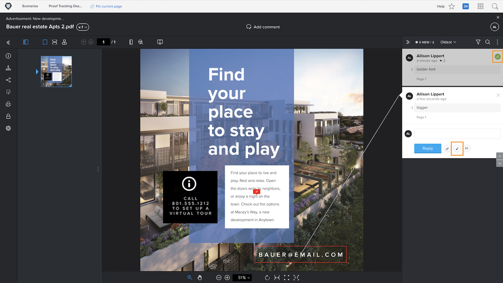

# Gestire i commenti della bozza

[!DNL Workfront] consente di tenere traccia e gestire il lavoro correlato a ciascun commento su una bozza, ad esempio apportando correzioni alla risorsa, con azioni per commento o risolvendo commenti.

Le azioni di bozza sono caratterizzate da un “flag” o “un’etichetta” su un commento e vengono spesso utilizzate per indicare che è stata intrapresa o è necessario intraprendere un’azione in merito al commento. Le azioni possono essere selezionate dall’icona o dal menu Altro di ciascun commento.

Ad esempio, sei responsabile di decidere quali correzioni effettuate durante il processo di revisione debbano essere effettivamente apportate. Utilizzando un’azione, puoi contrassegnare i commenti rilevanti, consentendo a un designer o a un editor di sapere quali revisioni apportare. Tale persona può quindi utilizzare un’altra azione per indicare che le modifiche sono state apportate.

![Immagine di una bozza nel Proofing viewer con l’azione bozza [!UICONTROL Attività] evidenziata sul commento.](assets/manage-comments-2.png)

Se non visualizzi le azioni elencate nei commenti, significa che la tua organizzazione non le ha configurate. Rivolgiti all’amministratore del sistema di verifica delle bozze se ritieni che le azioni debbano essere utilizzate dall’organizzazione.

La funzione “risolvi commento” viene comunemente utilizzata per indicare che un commento è stato affrontato in qualche modo: è stata apportata una correzione o è stata fornita una risposta a una domanda. Alcuni clienti di [!DNL Workfront] “risolvono” un commento quando si tratta di una correzione che non deve essere effettuata o è solo un commento che è stato letto.

Risolvi il commento facendo clic sull’icona del segno di spunta. In questo modo, al commento viene applicato un segno di spunta verde che consente di identificare facilmente i commenti esaminati durante l’analisi della rispettiva colonna.

Per facilitare la selezione attenta di ciò che visualizzi mentre lavori con la bozza, puoi filtrare la colonna dei commenti in base a entrambe queste funzioni.

![Immagine dei filtri di commento nel visualizzatore di bozze con le opzioni filtro [!UICONTROL Azioni] e [!UICONTROL Generale] evidenziate.](assets/manage-comments-3.png)

## Tocca a te

>[!IMPORTANT]
>
>Non dimenticare di ricordare ai colleghi assegnati a un flusso di lavoro per la bozza che stai lavorando con le bozze come parte del tuo corso di formazione su Workfront.

1. Trova una bozza che hai caricato su Workfront. Apri il Proofing Viewer per esaminare i commenti inseriti e rispondere a un commento. Al termine, chiudi il Proofing Viewer.
1. Utilizza la sezione Aggiornamenti, nei Dettagli documento o nel pannello Riepilogo, per visualizzare gli ultimi commenti su una bozza che hai caricato in Workfront. Rispondi a un commento.

<!--
## Learn more
* Create and manage proof comments
-->
