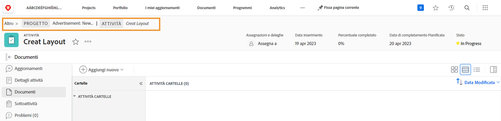

# Comprendere i dettagli della bozza

## Visualizza dettagli bozza

In qualità di gestore o proprietario delle bozze, puoi approfondire i dettagli alla base di una bozza attraverso il pannello di riepilogo e la [!UICONTROL Dettagli documento] pagina. Per prima cosa, cerca la bozza in [!UICONTROL Documenti] di un progetto, attività o problema.

### Pannello Riepilogo

Il pannello di riepilogo fornisce una panoramica di alto livello dei dettagli di base della bozza. Utilizza l’icona per espandere il pannello quando necessario e comprimerlo quando non lo desideri. Puoi anche passare il cursore sulla miniatura della bozza per aprirla o scaricarla.

![Un&#39;immagine del [!UICONTROL Documenti] sezione di un progetto con una bozza selezionata e il pannello di riepilogo espanso. Vengono evidenziate sia l&#39;icona del pannello di riepilogo che quella del pannello di riepilogo.](assets/document-summary.png)

Nota: il [!UICONTROL Approvazioni] nel pannello di riepilogo è per **documento** approvazioni e **non è** associato al processo di revisione e approvazione delle bozze su cui hai avuto modo di imparare in questo corso. I due processi sono distinti in [!DNL Workfront].

### [!UICONTROL Dettagli Documento]

Per ulteriori informazioni sulla bozza, consulta [!UICONTROL Dettagli documento] porta alla &quot;pagina&quot; della bozza in [!DNL Workfront].

![Immagine della pagina della bozza in [!DNL  Workfront].](assets/document-details.png)

È importante notare che la possibilità di visualizzare informazioni relative al processo di verifica dipende dalle autorizzazioni di verifica in [!DNL Workfront].

Dalla pagina della bozza, puoi accedere alle sezioni seguenti dal menu del pannello a sinistra:

* **Aggiornamenti -** I commenti aggiunti nel visualizzatore bozze vengono visualizzati qui, con il tag &quot;proof comment&quot; (commento bozza). È inoltre possibile aggiungere commenti al file, proprio come si fa per un&#39;attività o un progetto (questi commenti non vengono visualizzati nel visualizzatore bozze).
* **Approvazioni —** Questa sezione è destinata alle approvazioni di documenti, non alle approvazioni di verifica. I due tipi di approvazione sono processi separati in [!DNL Workfront] e non collegarsi tra loro. Se utilizzi flussi di lavoro di bozza per le revisioni e le approvazioni, non utilizzerai questa sezione.
* **Tutte le versioni —** Traccia e gestisci la cronologia delle versioni della bozza. Per accedere più facilmente a queste informazioni, consulta il pannello di riepilogo su [!UICONTROL Documenti] elenco.
* **Forms personalizzato —** I moduli personalizzati vengono utilizzati come bozze per acquisire informazioni specifiche per l’organizzazione. Queste informazioni possono essere trasmesse con il file ai sistemi di storage dei documenti integrati, ad esempio [!DNL Workfront] DAM o [!DNL Adobe’s] AEM. I moduli personalizzati sono configurati dal [!DNL Workfront] amministratore di sistema o amministratore di gruppo. Parla con il tuo team o con gli amministratori per sapere se utilizzerai moduli personalizzati sulle bozze.
* **Flusso di lavoro bozza —** Gestisci o modifica il flusso di lavoro assegnato alla bozza. È possibile aprire questa finestra utilizzando [!UICONTROL Flusso di lavoro bozza] collegamento sulla bozza in [!UICONTROL Documenti] anche un elenco. Scopri come apportare modifiche al flusso di lavoro con il video Edit a proof workflow (Modifica un flusso di lavoro per una bozza).

Esaminiamo più da vicino due sezioni: [!UICONTROL Impostazioni visualizzatore bozze] e [!UICONTROL Attività bozza].

### [!UICONTROL Impostazioni visualizzatore bozza]

Queste impostazioni consentono di controllare l’accesso alla bozza stessa.

![Un&#39;immagine del [!UICONTROL Impostazioni visualizzatore bozze] dalla pagina della bozza con [!UICONTROL Impostazioni visualizzatore bozze] opzione evidenziata nel menu del pannello sinistro.](assets/proofing-settings-on-details-page.png)

* **[!UICONTROL Accesso obbligatorio. Questa bozza non può essere condivisa con utenti guest] —** La bozza può essere condivisa solo con persone che hanno un [!DNL Workfront] licenza di verifica.
* **[!UICONTROL Richiedi firma elettronica per le decisioni] —** Quando si condivide una bozza, è necessario che il destinatario disponga delle autorizzazioni di verifica in [!DNL Workfront] e li fa &quot;firmare elettronicamente&quot; la bozza immettendo la password della bozza quando prendono una decisione sulla bozza. (Nota: la password di verifica è diversa dalla password [!DNL Workfront] password. La password di verifica non è facilmente accessibile, pertanto la maggior parte dei destinatari non la conosce.) [!DNL Workfront] consiglia di parlare con il [!DNL Workfront] prima di utilizzare questa funzione.
* **[!UICONTROL Blocca la bozza quando vengono prese tutte le decisioni necessarie]—** Questo blocca la bozza a qualsiasi ulteriore commento, risposta, decisione, ecc., una volta presa ogni decisione sulla bozza. Questo blocca l’intera versione della bozza, non solo una fase specifica del flusso di lavoro di bozza.
* **[!UICONTROL Consenti il download del file originale] —** I destinatari della bozza possono scaricare il file sorgente originale della bozza dal visualizzatore di bozze (l’opzione si trova nel menu del pannello di destra).
* **[!UICONTROL Consenti condivisione bozze tramite URL pubblico o codice incorporato] —** I destinatari della bozza possono condividere con chiunque un collegamento alla bozza accessibile al pubblico.
* **[!UICONTROL Consenti l’abbonamento alla bozza tramite URL pubblico o codice incorporato] —** Chiunque riceva l’URL pubblico può aggiungersi alla bozza con il proprio indirizzo e-mail e nome (se non si tratta di un utente di bozze) oppure con il proprio indirizzo e-mail e la propria password di bozza (se si tratta di un utente di bozze). (Nota: la password di verifica non è la stessa di una [!DNL Workfront] password.)

Queste stesse impostazioni possono essere impostate quando la bozza viene caricata in [!UICONTROL Impostazioni bozza] nella parte inferiore della finestra di caricamento.

![Un&#39;immagine del [!UICONTROL Impostazioni bozza] nella parte inferiore della finestra di caricamento.](assets/proof-settings-on-upload-page.png)

### [!UICONTROL Attività bozza]

Questa pagina tiene traccia di tutte le attività che si sono verificate sulla bozza, oltre ai messaggi e-mail inviati relativi a questa bozza.

![Un&#39;immagine del [!UICONTROL Attività bozza] sezione della pagina della bozza con [!UICONTROL Attività bozza] opzione evidenziata nel menu del pannello sinistro.](assets/proofing-activity-in-details.png)

Il [!UICONTROL Attività] sezione timestamp in cui sono stati presi commenti e decisioni, oltre a chi li ha creati. Tiene inoltre traccia di quando sono iniziate le fasi del flusso di lavoro di verifica, di quando un destinatario ha aperto per la prima volta una bozza e di altre informazioni che un responsabile o un proprietario della bozza vorrà conoscere. Questi dettagli possono essere utili quando cerchi di capire cose come, ad esempio, perché una fase del flusso di lavoro di bozza non è mai iniziata.

Il [!UICONTROL Messaggi] sezione timestamp in cui gli avvisi e i messaggi e-mail sono stati inviati ai destinatari, che li hanno inviati, e il contenuto del messaggio. Questo può essere utile durante la risoluzione dei problemi se qualcuno dice di non aver ricevuto un’e-mail relativa a una bozza. Puoi verificare se e quando è stato inviato un messaggio e-mail.

[!DNL Workfront] consiglia al responsabile della bozza e al proprietario della bozza di acquisire familiarità con le informazioni contenute in queste due sezioni. Quando si combinano queste informazioni con la comprensione di come leggere [!UICONTROL SOCD] barra di avanzamento, puoi comprendere e gestire le bozze, indipendentemente da dove si trovano nel flusso di lavoro di bozza.

Una volta terminato di lavorare in [!UICONTROL Dettagli documento] , utilizza la traccia delle breadcrumb per tornare alla sezione [!UICONTROL Documenti] sezione del progetto, attività o problema a cui è allegata la bozza.

<!--
#### Learn more
* [!UICONTROL Document details] overview
* Add a custom form to a document
* Request document approvals
* Summary for documents overview
* View activity on a proof within [!DNL Workfront]
-->
