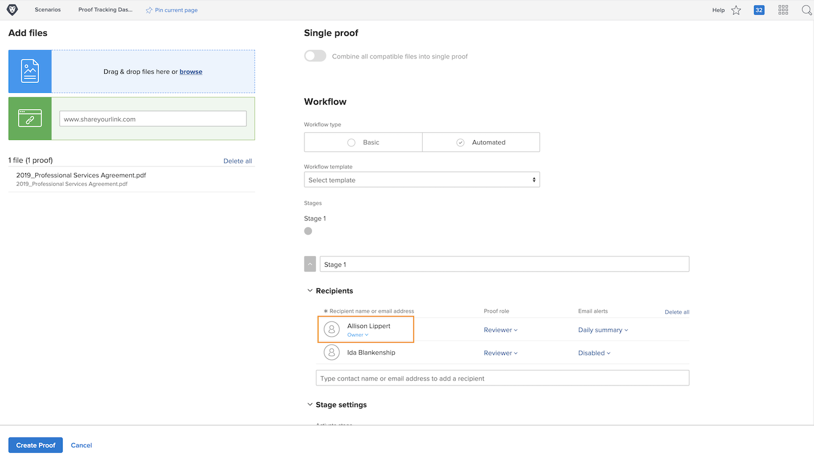

# Caricare una bozza con un flusso di lavoro automatizzato

In questo video scoprirai:

* Quando è possibile utilizzare un flusso di lavoro di bozza automatizzato
* Come applicare un flusso di lavoro utilizzando un modello di bozza
* Come impostare un flusso di lavoro automatizzato da zero

>[!VIDEO](https://video.tv.adobe.com/v/335133/?quality=12&learn=on&enablevpops=1)

## Impostazioni aggiuntive del flusso di lavoro della bozza

Le impostazioni nella parte inferiore della finestra di caricamento della bozza sono facoltative; verifica quindi con l’organizzazione se e come le utilizzi.

![Immagine della finestra [!UICONTROL Nuova bozza]con [!UICONTROL Impostazioni fase] evidenziato.](assets/additional-proof-workflow-settings.png)

* **[!UICONTROL Fase di blocco]:** in questo modo le persone in questa fase del flusso di lavoro non possono aggiungere commenti o modificare le decisioni una volta completata la fase del flusso di lavoro.
* **[!UICONTROL Trasferisci i diritti di decisione primari a]:** accelera il processo di verifica delle bozze designando un responsabile delle decisioni principale. Una volta impostato, [!DNL Workfront] riconosce la decisione di bozza da parte di questa persona come LA decisione. Una volta che quella persona prende la sua decisione, la fase è finita e non sono necessarie altre decisioni.
* **[!UICONTROL Richiedi una sola decisione per questa fase]:** un altro modo per semplificare il processo di verifica consiste nel richiedere una sola decisione sulla bozza. Con questa opzione attivata, indipendentemente dal numero di approvatori in quella fase, una volta che uno di loro prende una decisione, quella fase è completa.
* **[!UICONTROL Rendi privata questa fase]:** per impostazione predefinita, i commenti sulla bozza sono visibili a tutti in tutte le fasi. Impedisci ai destinatari delle bozze in altre fasi di visualizzare i commenti aggiunti in questa fase facendo clic sulla casella.

Nella parte inferiore della finestra di caricamento della bozza si trovano diverse impostazioni che influiscono sulla sicurezza della bozza, ad esempio la richiesta di un accesso per visualizzare la bozza.

<!--
Learn more about these in the Proof settings section of the Configure a proof article.
-->

![Immagine della sezione [!UICONTROL Impostazioni bozza] della finestra di caricamento bozza.](assets/additional-proof-workflow-settings-2.png)

<!--
### Learn more
* Automated workflow overview
* Automated workflow stages overview
-->

<!--
### Guides
* Plan an advanced workflow worksheet
-->

## Perché fai parte del flusso di lavoro di bozza?

Noterai di essere nell’elenco dei destinatari della bozza perché sei tu quello che carica la bozza. Questo ti rende anche il proprietario della bozza, che ti offre i diritti di modifica sulla bozza, consentendo, tra le altre cose, di modificare le impostazioni del flusso di lavoro o caricare una nuova versione.

Se stai solo caricando la bozza ma il flusso di lavoro sarà gestito da un altro utente, puoi cambiare il proprietario della bozza facendo clic sul pulsante [!UICONTROL Proprietario] e immettendone il nome. Questa opzione è consigliata se un utente diverso dall’utente originale sta caricando una versione.

## Tocca a te

>[!IMPORTANT]
>
>Non dimenticare di ricordare ai tuoi colleghi che stai inviando loro una bozza come parte del tuo corso di formazione su Workfront.

Carica una bozza con un flusso di lavoro avanzato. Se nell’organizzazione sono già configurati dei modelli di bozza, seleziona quello utilizzato dal team e apporta alcune modifiche.

* Modifica gli avvisi e-mail in modo che nessuno venga informato quando l’attività si verifica sulla bozza.
* La prima fase deve avere 2 revisori/approvatori.
* La seconda fase deve avere un solo revisore/approvatore.

Se nell’organizzazione non sono ancora stati creati modelli di bozza, imposta un flusso di lavoro in due fasi da zero.

* Assegna te stesso e il tuo collega preferito alla prima fase.
* Imposta la scadenza per la prima fase a 1 giorno dalla creazione della bozza.
* Assegna un altro collega preferito alla seconda fase.
* Avvia la fase una volta passata la scadenza della prima fase.
* Dai alla persona in questa fase 2 giorni per completare la revisione, ma deve essere fatta entro mezzogiorno.

